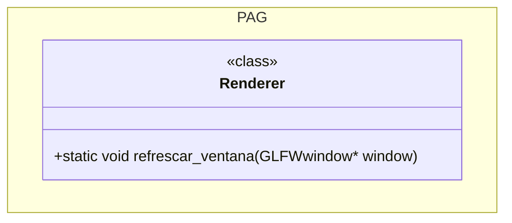
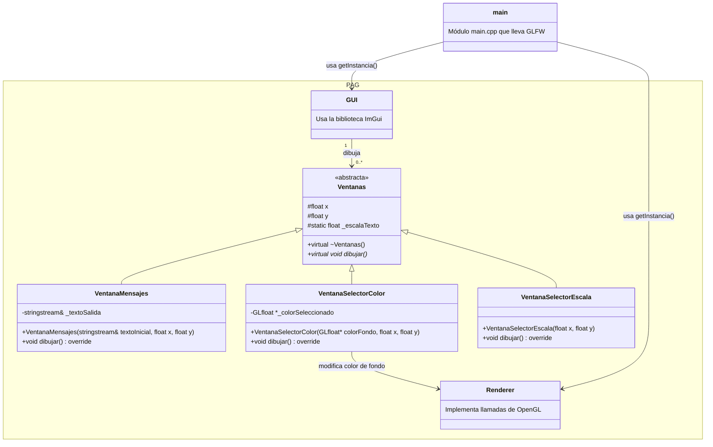
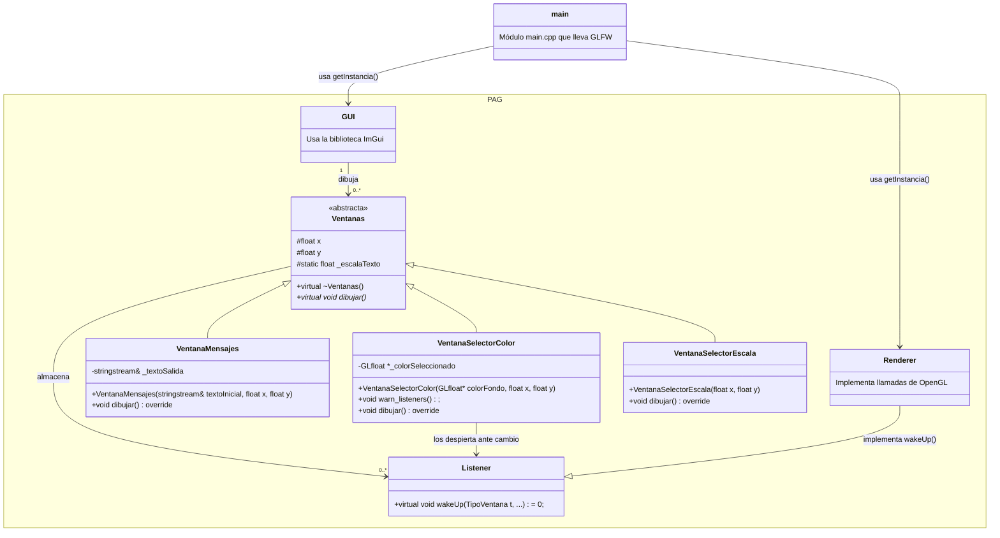

# PAG 26-27 Raúl Fernández Rivilla

## Práctica 1

### Callback de cambio de color mediante "scroll" del ratón

Para la implementación de este callback, se ha optado por hacer que la ventana varíe en su tonalidad de gris conforme
se desplaza la rueda del ratón. Para esta finalidad es importante obtener el color actual de la ventana sobre el que hacer una variación. 
Esto se consigue mediante la constante `GL_COLOR_CLEAR_VALUE`.

Después, es importante que el valor de los colores no exceda de sus rangos. En OpenGL es [0, 1]. Por tanto, se ha de implementar una lógica 
para subsanar esto (ya que el scroll es infinito y nuestra paleta de colores no).

En este caso, se ha optado por hacer un bucle de colores. Por ejemplo, cuando se llega al límite superior del rojo, este vuelve a 0. Esto
ocurre igual con el límite inferior y con el resto de colores. Por tanto, esto resulta en la consecución del negro tras el blanco (subiendo el scroll)
o la consecución del blanco tras el negro (si se baja el scroll).

Cabe recalcar que si se quiere hacer una gestión básica de estos límites, se tiene la función "clamp" vista en teoría que sencillamente redondea o
"scale" que adapta el resto de valores al mayor. Como en este caso concreto `r`, `g` y `b` son iguales, 
sucederia lo mismo que con "clamp".

### Ejercicio de reflexión

#### Planteamiento

En primera instancia, consideré oportuno replicar el fallo para observar el modo en el que representa el fallo el compilador. Al crear la función en la clase `Renderer` 
dentro del espacio de nombres de `PAG` y al añadirla como callback a `glfwSetWindowRefreshCallback` el fallo que se presentaba era el siguiente:

```text
Cannot convert void(PAG::Renderer::*)(GLFWwindow *window) to parameter type GLFWwindowrefreshfun (aka void(*)(GLFWwindow *window))
```

Es decir, el fallo que nos da, es que el "tipo" de función no es correcta. La diferencia la encontramos en el primer paréntesis tras `void`. 
En uno aparece `void(PAG::Renderer::*)(GLFWwindow *window)` mientras que en el otro aparece `void(*)(GLFWwindow *window)`

`void(PAG::Renderer::*)(GLFWwindow *window)` es lo que se denomina **puntero a función miembro**. Esto quiere decir  que hasta que no se instancia un objeto de tipo Renderer, esa función no se encuentra disponible. 

Un puntero a una función miembro dista de un puntero a una función normal en el hecho de que la primera necesita saber qué instancia la está invocando para actuar sobre ella (ya que al declarar la función dentro de la clase de esta forma, se asume que se busca un cambio en el objeto).

Sin embargo, nosotros queremos una función "genérica" y desacoplada que no busca actuar sobre ninguna instancia conreta. De esta forma pude hacerlo funcionar con dos soluciones.

#### Soluciones

Una alternativa podría ser tratar a `Renderer` como un espacio de nombres anidado dentro de `PAG`. A nivel práctico se tendría lo que buscamos aunque a nivel teórico no se tendría
una clase `Renderer`.

Esta solución funciona por el hecho de que se está declarando una función genérica en un espacio de nombres que, por tanto, no está asociada a ningún objeto.

Sin embargo, haciendo esto, me acordé de la sentencia `static` que será la verdadera solución a este problema. La palabra clave **`static`** permite establecer un método dentro de una
clase que es **común a todas las instancias**. Por tanto, no está ligado a ninguna de ellas. 

Al probar esto, la compilación fue correcta y todo funcionó como debería. Además, la inicialización sucede al invocar al propio método o al generar una instancia de la clase. A partir de ahí
da igual cuántas instancias se creen que el método solo existirá una vez en memoria. Así, todos los _callbacks_ que no dependen de un objeto deben ser implementados de esta manera.




### Corrección tras la práctica 1

Al pensar que la función ``refrescar_ventana`` tenía el siguiente cuerpo:

```c++
    void Renderer::refrescar() {
        glClear(GL_COLOR_BUFFER_BIT | GL_DEPTH_BUFFER_BIT);     
        glfwSwapBuffers(window);
        std::cout << "Callback de refresco llamado" << std::endl;
    }
```

pensé que al no depender de ningún objeto podría implementarse directamente como una función estática. Sin embargo,
si se piensa en separar responsabilidades, la primera sentencia es de OpenGL (GLAD) y la segunda, de GLFW.

Por tanto, el método refrescar perteneciente a la clase ``Renderer`` ha de tener (y así es en la práctica 2) la siguiente
forma:

```c++
    void Renderer::refrescar() {
        glClear(GL_COLOR_BUFFER_BIT | GL_DEPTH_BUFFER_BIT);     
    }
```

Esto ya no puede adjuntarse al _Callback_ (ya que nos faltan sentencias en la función). Por tanto, debemos incorporar esta
responsabilidad (de OpenGL) a un _Callback_ "padre". Esto es:

```c++
    void callback_padre() {
        //Aquí iría la función de refresco OpenGL (de Renderer)    
        glfwSwapBuffers(window);
        std::cout << "Callback de refresco llamado" << std::endl;
    }
```

Así, para incluir la función de refresco de Renderer hay 2 posibilidades:
- Hacerla _static_ (en caso de que la función de refresco **no esté vinculada al estado del objeto ``Renderer``**).
- Implementar el patrón _Singletone_ que **permitiría el acceso de la función al _único objeto_ de tipo ``Renderer``**. La función sería
unívoca al existir tan solo una instancia de esta clase.

En la práctica 2 se ha optado por la segunda solución. Por tanto, entiendo que en algún punto (alguna práctica futura) 
la función de refresco será dependiente de la instancia de ``Renderer``. De hecho, revisando la práctica 2, 
se puede considerar que ``refrescar_ventana()`` ha de hacer uso del atributo ``color_fondo`` propio de la instancia de ``Renderer``
para cambiar el color del fondo en cada refresco (llamado por los observables: las ventanas).


## Práctica 2

Esta práctica se ha dividido en 3 etapas detalladas en las siguiente secciones.

### Desacoplamiento de OpenGL (clase Renderer)

En primera instancia se han desacoplado (como se venía anunciando en la práctica 1) las llamadas a funciones de OpenGL
en una nueva clase: ``PAG::Renderer``.

Aquí he desacoplado todo lo competente a GLAD (y por ende, a OpenGL) y he almacenado todas las variables competentes a 
la escena (en este caso, tan solo el **color de fondo**).

Lógicamente, como solo se tiene una escena (un rendering), solo se puede tener **una instancia** de la clase ``Renderer``.
Por tanto, todo este proceso se ha llevado a cabo siguiendo el patrón _Singletone_ que se detalla en el guión.

Para ello, se ha de tener un atibuto estático con la única instancia de la clase y el constructor **ha de ser privado**.

```c++
    class Renderer{
    private:
        static Renderer *instancia;
        GLfloat *_colorFondo;

        Renderer(); //Constructor privado (Singletone)
```

Para acceder a la instancia, se ha de tener el siguiente método en `Renderer.cpp`:

```c++
    PAG::Renderer *PAG::Renderer::instancia = nullptr;

    PAG::Renderer &PAG::Renderer::getInstancia() {
        if (!instancia) {
            // Lazy initialization: si aún no existe, lo crea
            instancia = new Renderer(); //<--- Aquí es donde se llama al constructor privado
        }
        return *instancia;
    }
```


De esta manera, todas las funciones que tenía en ``main.cpp`` han sido modificadas para acceder a esta única instancia y
hacer la llamada a la función OpenGL correspondiente. Un ejemplo:


```c++
  void framebuffer_size_callback(GLFWwindow *window, int width, int height) 
  {
    PAG::Renderer::getInstancia().redimensionar(width, height);
    std::cout << "Callback de redimension llamado" << std::endl;
  }
```

Y en su interior, redimensionar tiene la siguiente implementación:


```c++
    void Renderer::redimensionar(int width, int height) 
    {
        glViewport(0, 0, width, height);
    }
```

### Incorporación de ImGui

Tras instalar la biblioteca ImGui (responsable de la gestión de ventanas en esta práctica) se ha hecho una nueva clase:
`GUI`. Esta, al igual que `Renderer`, implementa el patrón _Singletone_ para operar con la biblioteca. Esta instancia tiene
3 métodos de interés:

```c++
        void inicializacionIMGUI();

        void finalizacionIMGUI();

        void dibujarVentanas(const std::vector<PAG::Ventanas*>& ventanas);
```

Las 2 primeras funciones permiten una gestión generalizada en `main.cpp` de la biblioteca ImGui. Ojo, si nos introducimos
en alguna de estas 2 primeras funciones, se observará que se tienen cuestiones **generales** de inicialización
y finalización de la biblioteca. Pondré como ejemplo la inicialización:

```c++
    void PAG::GUI::inicializacionIMGUI ()
    {
        IMGUI_CHECKVERSION();
        ImGui::CreateContext ();
        ImGuiIO& io = ImGui::GetIO();
        io.ConfigFlags |= ImGuiConfigFlags_NavEnableKeyboard;
    }
```

De esta manera, se separan responsabilidades. `GUI` no sabe si estamos con GLFW o con OpenGL. Es por ello por lo que las 
cuestiones de inicialización específicas se han delegado en `main.cpp`:


```c++
    //Inicialización de ImGui
    PAG::GUI::getInstancia().inicializacionIMGUI();

    //Para el caso de GLFW y OpenGL, hay que completar la inicialización con las siguientes llamadas:
    ImGui_ImplGlfw_InitForOpenGL ( window, true );
    ImGui_ImplOpenGL3_Init ();
```

El tercer método (para dibujar ventanas), es el más interesante de estos tres. La implementación de este método es la 
siguiente:

```c++
    void PAG::GUI::dibujarVentanas (const std::vector<PAG::Ventanas*>& ventanas)
    {
        ImGui_ImplOpenGL3_NewFrame();
        ImGui_ImplGlfw_NewFrame();
        ImGui::NewFrame();
        // Se dibujan los controles de Dear ImGui

        //Dibujado de cada ventana
        for (PAG::Ventanas* ventana : ventanas) {
            ventana->dibujar();
        }

        // Aquí va el dibujado de la escena con instrucciones OpenGL
        ImGui::Render();
        ImGui_ImplOpenGL3_RenderDrawData ( ImGui::GetDrawData() );
    }
```

Se observa que se tienen todas las cuestiones de renderizado de ImGui de ventanas en esta única función. Veamos el funcionamiento
de esto.

En primera instancia, se pasa por parámetro las ventanas. Esto lo hice para que las ventanas las crease el usuario en `main.cpp`
(permite que la implementación sea más intuitiva). Podría ponerse sin problema como atributo de la clase.

Si se observa, en la práctica 2 se pide tener al menos 2 ventanas: una que muestre los **mensajes de consola** y otra para 
**seleccionar el color de fondo**. 

Para gestionar esto, opté por establecer una jerarquía de ventanas (desde una clase abstracta `Ventanas`) para poder almacenar
las distintas ventanas en un vector y llamar a su dibujado de manera equivalente. Por tanto, el método
`dibujar()` debía ser **virtual puro** (para que fuese obligatoriamente implementado por las clases hijas). De esta manera,
la clase abstracta de ventanas tiene la siguiente forma:

```c++
    class Ventanas {
    protected:
        float x = 10;                       //Posiciones x,y de las ventanas
        float y = 10;
        static float _escalaTexto;          //Compartida por todas las ventanas (para mantener consistencia)
    public:
        virtual ~Ventanas() = default;
        virtual void dibujar() = 0;     //Indico que es un virtual puro (se ha de sobre-escribir esta función)
    };
```

Y luego cada una de las ventanas (con sus propios atributos) debían heredar de esta clase abstracta. Por ejemplo, la ventana
de mensajes de consola tiene la siguiente forma:

```c++
    class VentanaMensajes : public Ventanas{
    private:
        std::stringstream &_textoSalida;     //Importante por referencia para que se vaya actualizando
    public:
        VentanaMensajes(std::stringstream &textoInicial, float x, float y);
        void dibujar() override;
    };
```

El método `dibujar()` tiene la siguiente forma:

```c++
    void VentanaMensajes::dibujar() {

        //Posición a dibujar
        ImGui::SetNextWindowPos ( ImVec2 (x, y), ImGuiCond_Once );

        {
            if ( ImGui::Begin ( "Mensajes" ) ){ // La ventana está desplegada

                ImGui::SetWindowFontScale ( _escalaTexto ); // Escalamos el texto si fuera necesario

                //Pintamos el buffer de texto de salida
                ImGui::TextUnformatted(_textoSalida.str().c_str());
            }

            // Si la ventana no está desplegada, Begin devuelve false
            ImGui::End ();
        }
    }
```

Por tanto, en el ciclo de eventos del `main.cpp` basta con definir de forma inicial cada una de las ventanas y, en el
ciclo de eventos, mostrarlas. En esta práctica añadí también una ventana de selección de escala de texto:


```c++
    //Establecenmos una ventana de mensajes, una ventana de selección de color y una se selección de escala de fuente
    auto *ventana_mensajes = new PAG::VentanaMensajes(buffer, 10, 10);
    auto *ventana_color = new PAG::VentanaSelectorColor(PAG::Renderer::getInstancia().getColorFondo(), 280,40);
    auto *ventana_escala = new PAG::VentanaSelectorEscala(100, 400);

    std::vector<PAG::Ventanas*> ventanas = {
        ventana_mensajes,
        ventana_color,
        ventana_escala
    };

    //Ciclo de eventos
    while (!glfwWindowShouldClose(window)) {
        
        PAG::Renderer::getInstancia().refrescar();

        // DIBUJADO DE VENTANAS 
        //---------------------

        PAG::GUI::getInstancia().dibujarVentanas(ventanas);
        
        //----------------------------------------------------------------------------
        
        glfwSwapBuffers(window);
        glfwPollEvents();
    }
```

De esta manera, en un diagrama UML se puede presentar todo lo mencionado de manera intuitiva:


_NOTA: No he introducido todas las variables y métodos de las clases para hacer un diagrama más comprensible._


### Implementación del patrón observador

Si se observa el **ciclo de eventos** anterior, se observa la siguiente sentencia:

```c++
PAG::Renderer::getInstancia().refrescar();
```

Este método se encarga de hacer efectivos los cambios que deban producirse en pantalla. Para ello, pinta el buffer trasero
con todas las propiedades reflejadas por las variables de la clase **Renderer**. Como hasta ahora solo tenemos el color,
lo hace de la siguiente manera:

```c++
    void Renderer::refrescar() 
    {
        glClearColor(_colorFondo[0], _colorFondo[1], _colorFondo[2], _colorFondo[3]);
        glClear(GL_COLOR_BUFFER_BIT | GL_DEPTH_BUFFER_BIT);     //Pinta el Buffer trasero
    }
```

En un futuro, se tendrán aquí muchos más parámetros para controlar la escena. Por tanto, tenemos un problema: esta llamada
está haciéndose en cada iteración del bucle de eventos sin que quizá sea necesario. Puede que el color no cambie y sin embargo
se "repinte" la escena. La solución a esto es el **patrón observador**.

Se ha creado una interfaz `Listener` de la que "heredarán" todas aquellas clases que deban responder ante cambios de una serie
de entidades observables. En este caso hay que entender quien es el observador y quien el observable.

La ventana de color (que es la que nos compete en este caso), hace un cambio de color. Este será el "notificador" o el objeto
**observable**. La clase `Renderer` es la que tiene que observar (escuchar) si ha cambiado el color seleccionado. Por tanto,
esta es la clase **observadora**.

De esta manera, `Renderer` debe heredar de `Listener`. Los `Listener` (como son llamados por ventanas) se "despertarán" en 
cuanto alguna ventana lo requiera, por tanto la implementación de Listener es la siguiente:

```c++
    /**
     * Enumerado de tipo de ventanas (de Ventanas.h)
     *
     * Ellas usan este enumerado para avisar de un evento y que el Listener sepa quién lo produjo
     */
    enum TipoVentana {
        V_Mensajes,
        V_Selecc_Color,
        V_Selecc_Escala
    };

    class Listener {
    public:
        Listener () = default;
        virtual ~Listener () = default;
        // TipoVentana es un enum para identificar el tipo de ventana
        // de la interfaz que quiere despertarme
        virtual void wakeUp ( TipoVentana t, ... ) = 0;

    };
```

Así, Renderer reimplementará el método `wakeUp`. En este caso, solo tenemos que discernir el caso en el que la ventana de selección
de color haga cambios:

```c++
    void Renderer::wakeUp(TipoVentana t, ...) {
        switch (t) {
            case TipoVentana::V_Selecc_Color: {
                std::va_list args;
                va_start(args, t);
                GLfloat* nuevoColor = va_arg(args, GLfloat*);   //Se espera que la ventana V_Selecc_Color traiga consigo un color de tipo GLFloat*
                //En el guión aparece vec3 de GLM. De momento lo dejo así para que no haya leak de memoria
                if (nuevoColor) {
                    _colorFondo[0] = nuevoColor[0];
                    _colorFondo[1] = nuevoColor[1];
                    _colorFondo[2] = nuevoColor[2];
                    _colorFondo[3] = nuevoColor[3];
                    refrescar();    //<------------ AQUÍ ES DONDE SE REFRESCA (todo esto viene de dibujar ventanas) por tanto el glfwSwapBuffers(window) se hace después
                }
                va_end(args);
                break;
            }
            default: ;
                // Procesar el resto de tipos de ventana
        }
        // Terminar cualquier otro procesamiento que sea necesario
    }
```

Así, solo se llama cuando es necesario. Lo único que nos queda es que la ventana de color invoque a `wakeUp`. Para ello,
en la clase abstracta Ventanas se ha añadido un vector de `Listeners` que se rellenará con todas las entidades que quieran
escuchar cambios (en este caso solo Renderer):


```c++
    /**
     * Clase abstracta para establecer una jerarquía entre el tipo de ventanas
     */
    class Ventanas {
    protected:
        float x = 10;                     
        float y = 10;
        static float _escalaTexto;         
        std::vector<Listener*> _listeners;  //Observadores que se suscriben a los cambios producidos en las ventanas
    public:
        virtual ~Ventanas() = default;
        void addListener ( Listener *listener );    //Método para añadir observadores
        virtual void dibujar() = 0;   
    };
```

De esta manera, todas las ventanas tienen acceso a los `_listeners`. Ahora, quien quiera puede avisarlos cuando lo crea
conveniente. En el caso de la ventana de selección de color, se hace de la siguiente manera:

```c++
    void VentanaSelectorColor::dibujar() {
        ...
                if (ImGui::ColorPicker3("##Color de paleta", (float*)_colorSeleccionado, ImGuiColorEditFlags_PickerHueWheel | ImGuiColorEditFlags_NoSidePreview | ImGuiColorEditFlags_NoInputs | ImGuiColorEditFlags_NoAlpha)) {
                    cambio_color = true;
                }

        ...
                if (cambio_color) {
                    warn_listeners();   //Avisamos a observadores si el color cambió
                }
        ...
    }

    void VentanaSelectorColor::warn_listeners()
    {
        for (Listener* listener : _listeners) {
            listener->wakeUp(TipoVentana::V_Selecc_Color, _colorSeleccionado);  //<---- Anuncia el tipo de ventana y otorga la variable que necesita el observador
        }
    }
```

Así, la única entidad que se actualiza en cada iteración del ciclo de eventos son las ventanas de ImGui (por su naturaleza
interactiva). Luego, si se producen cambios en estas ventanas se renderiza la escena de nuevo actualizando las propiedades
que cambiaron en la clase `Renderer`. El diagrama que nos queda, es el siguiente:





