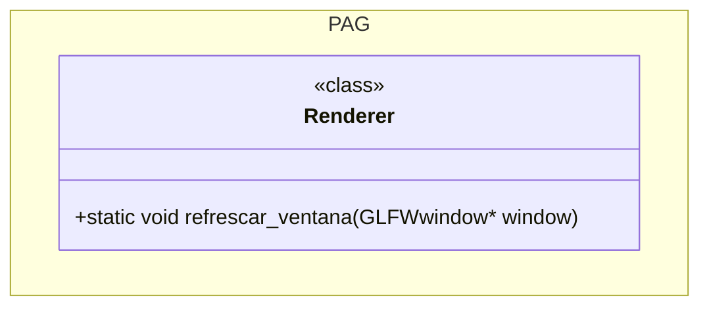
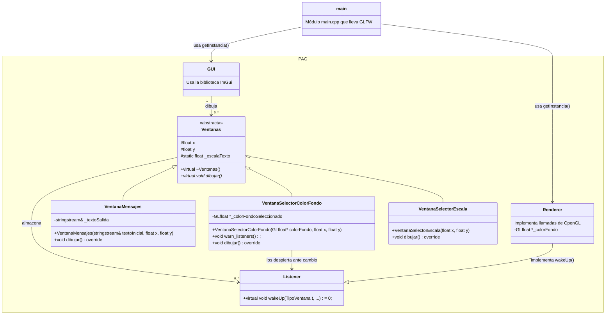

# PAG 26-27 Raúl Fernández Rivilla

## Índice

- [Práctica 1: Introducción. Inclusión de un callback para la rueda del ratón y ejercicio de reflexión.](#práctica-1)

- [Práctica 2: Refactorización y desacoplamiento de código. Incorporación de ImGui y patrones **_Singletone_ y Observador**.](#práctica-2)

- [Práctica 3: Implementación de Program Shader y modelo de un triángulo](#práctica)

## Práctica 1

### Callback de cambio de color mediante "scroll" del ratón

Para la implementación de este callback, se ha optado por hacer que la ventana varíe en su tonalidad de gris conforme
se desplaza la rueda del ratón. Para esta finalidad es importante obtener el color actual de la ventana sobre el que hacer una variación. 
Esto se consigue mediante la constante `GL_COLOR_CLEAR_VALUE`.

Después, es importante que el valor de los colores no exceda de sus rangos. En OpenGL es [0, 1]. Por tanto, se ha de implementar una lógica 
para subsanar esto (ya que el scroll es infinito y nuestra paleta de colores no).

En este caso, se ha optado por hacer un bucle de colores. Por ejemplo, cuando se llega al límite superior del rojo, este vuelve a 0. Esto
ocurre igual con el límite inferior y con el resto de colores. Por tanto, esto resulta en la consecución del negro tras el blanco (subiendo el scroll)
o la consecución del blanco tras el negro (si se baja el scroll).

Cabe recalcar que si se quiere hacer una gestión básica de estos límites, se tiene la función "clamp" vista en teoría que sencillamente redondea o
"scale" que adapta el resto de valores al mayor. Como en este caso concreto `r`, `g` y `b` son iguales, 
sucederia lo mismo que con "clamp".

### Ejercicio de reflexión

#### Planteamiento

En primera instancia, consideré oportuno replicar el fallo para observar el modo en el que representa el fallo el compilador. Al crear la función en la clase `Renderer` 
dentro del espacio de nombres de `PAG` y al añadirla como callback a `glfwSetWindowRefreshCallback` el fallo que se presentaba era el siguiente:

```text
Cannot convert void(PAG::Renderer::*)(GLFWwindow *window) to parameter type GLFWwindowrefreshfun (aka void(*)(GLFWwindow *window))
```

Es decir, el fallo que nos da, es que el "tipo" de función no es correcta. La diferencia la encontramos en el primer paréntesis tras `void`. 
En uno aparece `void(PAG::Renderer::*)(GLFWwindow *window)` mientras que en el otro aparece `void(*)(GLFWwindow *window)`

`void(PAG::Renderer::*)(GLFWwindow *window)` es lo que se denomina **puntero a función miembro**. Esto quiere decir  que hasta que no se instancia un objeto de tipo Renderer, esa función no se encuentra disponible. 

Un puntero a una función miembro dista de un puntero a una función normal en el hecho de que la primera necesita saber qué instancia la está invocando para actuar sobre ella (ya que al declarar la función dentro de la clase de esta forma, se asume que se busca un cambio en el objeto).

Sin embargo, nosotros queremos una función "genérica" y desacoplada que no busca actuar sobre ninguna instancia conreta. De esta forma pude hacerlo funcionar con dos soluciones.

#### Soluciones

Una alternativa podría ser tratar a `Renderer` como un espacio de nombres anidado dentro de `PAG`. A nivel práctico se tendría lo que buscamos aunque a nivel teórico no se tendría
una clase `Renderer`.

Esta solución funciona por el hecho de que se está declarando una función genérica en un espacio de nombres que, por tanto, no está asociada a ningún objeto.

Sin embargo, haciendo esto, me acordé de la sentencia `static` que será la verdadera solución a este problema. La palabra clave **`static`** permite establecer un método dentro de una
clase que es **común a todas las instancias**. Por tanto, no está ligado a ninguna de ellas. 

Al probar esto, la compilación fue correcta y todo funcionó como debería. Además, la inicialización sucede al invocar al propio método o al generar una instancia de la clase. A partir de ahí
da igual cuántas instancias se creen que el método solo existirá una vez en memoria. Así, todos los _callbacks_ que no dependen de un objeto deben ser implementados de esta manera.


```mermaid
classDiagram
    namespace PAG {
        class Renderer {
            <<class>>
            +static void refrescar_ventana(GLFWwindow* window)
        }
    }
```


### Corrección tras la práctica 1

Al pensar que la función ``refrescar_ventana`` tenía el siguiente cuerpo:

```c++
    void Renderer::refrescar() {
        glClear(GL_COLOR_BUFFER_BIT | GL_DEPTH_BUFFER_BIT);     
        glfwSwapBuffers(window);
        std::cout << "Callback de refresco llamado" << std::endl;
    }
```

pensé que al no depender de ningún objeto podría implementarse directamente como una función estática. Sin embargo,
si se piensa en separar responsabilidades, la primera sentencia es de OpenGL (GLAD) y la segunda, de GLFW.

Por tanto, el método refrescar perteneciente a la clase ``Renderer`` ha de tener (y así es en la práctica 2) la siguiente
forma:

```c++
    void Renderer::refrescar() {
        glClear(GL_COLOR_BUFFER_BIT | GL_DEPTH_BUFFER_BIT);     
    }
```

Esto ya no puede adjuntarse al _Callback_ (ya que nos faltan sentencias en la función). Por tanto, debemos incorporar esta
responsabilidad (de OpenGL) a un _Callback_ "padre". Esto es:

```c++
    void callback_padre() {
        //Aquí iría la función de refresco OpenGL (de Renderer)    
        glfwSwapBuffers(window);
        std::cout << "Callback de refresco llamado" << std::endl;
    }
```

Así, para incluir la función de refresco de Renderer hay 2 posibilidades:
- Hacerla _static_ (en caso de que la función de refresco **no esté vinculada al estado del objeto ``Renderer``**).
- Implementar el patrón _Singletone_ que **permitiría el acceso de la función al _único objeto_ de tipo ``Renderer``**. La función sería
unívoca al existir tan solo una instancia de esta clase.

En la práctica 2 se ha optado por la segunda solución. Por tanto, entiendo que en algún punto (alguna práctica futura) 
la función de refresco será dependiente de la instancia de ``Renderer``.


## Práctica 2

Esta práctica se ha dividido en 3 etapas detalladas en las siguiente secciones.

### Desacoplamiento de OpenGL (clase Renderer)

En primera instancia se han desacoplado (como se venía anunciando en la práctica 1) las llamadas a funciones de OpenGL
en una nueva clase: ``PAG::Renderer``.

Aquí he desacoplado todo lo competente a GLAD (y por ende, a OpenGL) y he almacenado todas las variables competentes a 
la escena (en este caso, tan solo el **color de fondo**).

Lógicamente, como solo se tiene una escena (un rendering), solo se puede tener **una instancia** de la clase ``Renderer``.
Por tanto, todo este proceso se ha llevado a cabo siguiendo el patrón _Singletone_ que se detalla en el guión.

Para ello, se ha de tener un atibuto estático con la única instancia de la clase y el constructor **ha de ser privado**.

```c++
    class Renderer{
    private:
        static Renderer *instancia;
        GLfloat *_colorFondo;

        Renderer(); //Constructor privado (Singletone)
```

Para acceder a la instancia, se ha de tener el siguiente método en `Renderer.cpp`:

```c++
    PAG::Renderer *PAG::Renderer::instancia = nullptr;

    PAG::Renderer &PAG::Renderer::getInstancia() {
        if (!instancia) {
            // Lazy initialization: si aún no existe, lo crea
            instancia = new Renderer(); //<--- Aquí es donde se llama al constructor privado
        }
        return *instancia;
    }
```


De esta manera, todas las funciones que tenía en ``main.cpp`` han sido modificadas para acceder a esta única instancia y
hacer la llamada a la función OpenGL correspondiente. Un ejemplo:


```c++
  void framebuffer_size_callback(GLFWwindow *window, int width, int height) 
  {
    PAG::Renderer::getInstancia().redimensionar(width, height);
    std::cout << "Callback de redimension llamado" << std::endl;
  }
```

Y en su interior, redimensionar tiene la siguiente implementación:


```c++
    void Renderer::redimensionar(int width, int height) 
    {
        glViewport(0, 0, width, height);
    }
```

### Incorporación de ImGui

Tras instalar la biblioteca ImGui (responsable de la gestión de ventanas en esta práctica) se ha hecho una nueva clase:
`GUI`. Esta, al igual que `Renderer`, implementa el patrón _Singletone_ para operar con la biblioteca. Esta instancia tiene
3 métodos de interés:

```c++
        void inicializacionIMGUI();

        void finalizacionIMGUI();

        void dibujarVentanas(const std::vector<PAG::Ventanas*>& ventanas);
```

Las 2 primeras funciones permiten una gestión generalizada en `main.cpp` de la biblioteca ImGui. Ojo, si nos introducimos
en alguna de estas 2 primeras funciones, se observará que se tienen cuestiones **generales** de inicialización
y finalización de la biblioteca. Pondré como ejemplo la inicialización:

```c++
    void PAG::GUI::inicializacionIMGUI ()
    {
        IMGUI_CHECKVERSION();
        ImGui::CreateContext ();
        ImGuiIO& io = ImGui::GetIO();
        io.ConfigFlags |= ImGuiConfigFlags_NavEnableKeyboard;
    }
```

De esta manera, se separan responsabilidades. `GUI` no sabe si estamos con GLFW o con OpenGL. Es por ello por lo que las 
cuestiones de inicialización específicas se han delegado en `main.cpp`:


```c++
    //Inicialización de ImGui
    PAG::GUI::getInstancia().inicializacionIMGUI();

    //Para el caso de GLFW y OpenGL, hay que completar la inicialización con las siguientes llamadas:
    ImGui_ImplGlfw_InitForOpenGL ( window, true );
    ImGui_ImplOpenGL3_Init ();
```

El tercer método (para dibujar ventanas), es el más interesante de estos tres. La implementación de este método es la 
siguiente:

```c++
    void PAG::GUI::dibujarVentanas (const std::vector<PAG::Ventanas*>& ventanas)
    {
        ImGui_ImplOpenGL3_NewFrame();
        ImGui_ImplGlfw_NewFrame();
        ImGui::NewFrame();
        // Se dibujan los controles de Dear ImGui

        //Dibujado de cada ventana
        for (PAG::Ventanas* ventana : ventanas) {
            ventana->dibujar();
        }

        // Aquí va el dibujado de la escena con instrucciones OpenGL
        ImGui::Render();
        ImGui_ImplOpenGL3_RenderDrawData ( ImGui::GetDrawData() );
    }
```

Se observa que se tienen todas las cuestiones de renderizado de ImGui de ventanas en esta única función. Veamos el funcionamiento
de esto.

En primera instancia, se pasa por parámetro las ventanas. Esto lo hice para que las ventanas las crease el usuario en `main.cpp`
(permite que la implementación sea más intuitiva). Podría ponerse sin problema como atributo de la clase.

Si se observa, en la práctica 2 se pide tener al menos 2 ventanas: una que muestre los **mensajes de consola** y otra para 
**seleccionar el color de fondo**. 

Para gestionar esto, opté por establecer una jerarquía de ventanas (desde una clase abstracta `Ventanas`) para poder almacenar
las distintas ventanas en un vector y llamar a su dibujado de manera equivalente. Por tanto, el método
`dibujar()` debía ser **virtual puro** (para que fuese obligatoriamente implementado por las clases hijas). De esta manera,
la clase abstracta de ventanas tiene la siguiente forma:

```c++
    class Ventanas {
    protected:
        float x = 10;                       //Posiciones x,y de las ventanas
        float y = 10;
        static float _escalaTexto;          //Compartida por todas las ventanas (para mantener consistencia)
    public:
        virtual ~Ventanas() = default;
        virtual void dibujar() = 0;     //Indico que es un virtual puro (se ha de sobre-escribir esta función)
    };
```

Y luego cada una de las ventanas (con sus propios atributos) debían heredar de esta clase abstracta. Por ejemplo, la ventana
de mensajes de consola tiene la siguiente forma:

```c++
    class VentanaMensajes : public Ventanas{
    private:
        std::stringstream &_textoSalida;     //Importante por referencia para que se vaya actualizando
    public:
        VentanaMensajes(std::stringstream &textoInicial, float x, float y);
        void dibujar() override;
    };
```

El método `dibujar()` tiene la siguiente forma:

```c++
    void VentanaMensajes::dibujar() {

        //Posición a dibujar
        ImGui::SetNextWindowPos ( ImVec2 (x, y), ImGuiCond_Once );

        {
            if ( ImGui::Begin ( "Mensajes" ) ){ // La ventana está desplegada

                ImGui::SetWindowFontScale ( _escalaTexto ); // Escalamos el texto si fuera necesario

                //Pintamos el buffer de texto de salida
                ImGui::TextUnformatted(_textoSalida.str().c_str());
            }

            // Si la ventana no está desplegada, Begin devuelve false
            ImGui::End ();
        }
    }
```

Por tanto, en el ciclo de eventos del `main.cpp` basta con definir de forma inicial cada una de las ventanas y, en el
ciclo de eventos, mostrarlas. En esta práctica añadí también una ventana de selección de escala de texto:


```c++
    //Establecenmos una ventana de mensajes, una ventana de selección de color y una se selección de escala de fuente
    auto *ventana_mensajes = new PAG::VentanaMensajes(buffer, 10, 10);
    auto *ventana_color = new PAG::VentanaSelectorColorFondo(PAG::Renderer::getInstancia().getColorFondo(), 280,40);
    auto *ventana_escala = new PAG::VentanaSelectorEscala(100, 400);

    std::vector<PAG::Ventanas*> ventanas = {
        ventana_mensajes,
        ventana_color,
        ventana_escala
    };

    //Ciclo de eventos
    while (!glfwWindowShouldClose(window)) {
        
        PAG::Renderer::getInstancia().refrescar();

        // DIBUJADO DE VENTANAS 
        //---------------------

        PAG::GUI::getInstancia().dibujarVentanas(ventanas);
        
        //----------------------------------------------------------------------------
        
        glfwSwapBuffers(window);
        glfwPollEvents();
    }
```

De esta manera, en un diagrama UML se puede presentar todo lo mencionado de manera intuitiva:


```mermaid
classDiagram
    namespace PAG {

        class Renderer {
            Implementa llamadas de OpenGL
            -GLfloat *_colorFondo
        }

        class GUI { 
            Usa la biblioteca ImGui
        }

        class Ventanas {
            <<abstracta>>
            #float x
            #float y
            #static float _escalaTexto
            +virtual ~Ventanas()
            +virtual void dibujar()*
        }

        class VentanaMensajes {
            -stringstream& _textoSalida
            +VentanaMensajes(stringstream& textoInicial, float x, float y)
            +void dibujar() override
        }

        class VentanaSelectorColorFondoFondo {
            -GLfloat *_colorFondoSeleccionado
            +VentanaSelectorColorFondo(GLfloat* colorFondo, float x, float y)
            +void dibujar() override
        }

        class VentanaSelectorEscala {
            +VentanaSelectorEscala(float x, float y)
            +void dibujar() override
        }
    }

    Ventanas <|-- VentanaMensajes
    Ventanas <|-- VentanaSelectorColorFondoFondo
    Ventanas <|-- VentanaSelectorEscala

    GUI "1" --> "0..*" Ventanas : dibuja
    VentanaSelectorColorFondoFondo --> Renderer : modifica color de fondo

    class main {
        Módulo main.cpp que lleva GLFW
    }

    main --> Renderer : usa getInstancia()
    main --> GUI : usa getInstancia()
```
_NOTA: No he introducido todas las variables y métodos de las clases para hacer un diagrama más comprensible._


### Implementación del patrón observador

Hasta este instante, la clase **Renderer** tan solo tiene un único atributo: **_colorFondo**, que además es un puntero
(por lo que las ventanas pueden modificarlo sin problema). Entonces, tal y como está la práctica ya es completamente funcional.
Es más, el hecho de que el color sea un puntero permite que una ventana de `ImGui` pueda cambiar el color de `Renderer`y que, si `Renderer` 
cambia, cambie la ventana de `ImGui` en consecuencia. Hay comunicación bidireccional. Sin embargo, aún hay una cuestión a resolver:
¿cuándo se cambia ese color con `glClearColor`?

Una primera solución pasa por implementar `glClearColor` dentro del método de refrescar en `Renderer`. De esta manera, el método 
quedaría así:

```c++
    void Renderer::refrescar() {
        glClearColor(_colorFondo[0], _colorFondo[1], _colorFondo[2], _colorFondo[3]);
        glClear(GL_COLOR_BUFFER_BIT | GL_DEPTH_BUFFER_BIT);     //Pinta el Buffer trasero
    }
```

Sin embargo, resulta ineficiente estar cambiando el color todo el tiempo sin que tan siquiera haya habido un cambio. Es aquí donde entra el **Patrón observador**.

Las ventanas serán los elementos observables y `Renderer` el observador. En cuanto algo cambie en las ventanas, `Renderer`
ejecutará algo. Por ejemplo, en este caso, cada vez que cambie el color, la ventana de selección de color de fondo llamará
a `Renderer` para que ejecute la sentencia de OpenGL acorde. En un futuro, las distintas ventanas "despertarán" a `Renderer`
para que ejecuten las sentencias que se necesiten.

Para la implementación de esto, se ha optado por tener una clase abstracta `Listener` que contendrá un método `wakeUp`. 
Este, se encarga de ejecutar el código necesario según la ventana que despierte al observador.

```c++
    /**
     * Enumerado de tipo de ventanas (de Ventanas.h)
     *
     * Ellas usan este enumerado para avisar de un evento y que el Listener sepa quién lo produjo
     */
    enum TipoVentana {
        V_Mensajes,
        V_Selecc_Color_Fondo,
        V_Selecc_Escala
    };

    class Listener {
    public:
        Listener () = default;
        virtual ~Listener () = default;
        // TipoVentana es un enum para identificar el tipo de ventana
        // de la interfaz que quiere despertarme
        virtual void wakeUp ( TipoVentana t, ... ) = 0;

    };
```

Así, Renderer reimplementará el método `wakeUp`. En este caso, solo tenemos que discernir el caso en el que la ventana de selección
de color haga cambios:

```c++
    void Renderer::wakeUp(TipoVentana t, ...) {     // ... = Lista de argumentos variables según la ventana.
        switch (t) {
            case TipoVentana::V_Selecc_Color_Fondo: {     //Podría pasar un color, pero en realidad ya está cambiando _colorFondo por puntero
                glClearColor(_colorFondo[0], _colorFondo[1], _colorFondo[2], _colorFondo[3]);
                break;
            }
            default: ;
                // Procesar el resto de tipos de ventana
        }
        // Terminar cualquier otro procesamiento que sea necesario
    }
```

Así, solo se llama cuando es necesario. Lo único que nos queda es que la ventana de color invoque a `wakeUp`. Para ello,
en la clase abstracta Ventanas se ha añadido un vector de `Listeners` que se rellenará con todas las entidades que quieran
escuchar cambios (en este caso solo Renderer):


```c++
    /**
     * Clase abstracta para establecer una jerarquía entre el tipo de ventanas
     */
    class Ventanas {
    protected:
        float x = 10;                     
        float y = 10;
        static float _escalaTexto;         
        std::vector<Listener*> _listeners;  //Observadores que se suscriben a los cambios producidos en las ventanas
    public:
        virtual ~Ventanas() = default;
        void addListener ( Listener *listener );    //Método para añadir observadores
        virtual void dibujar() = 0;   
    };
```

De esta manera, todas las ventanas tienen acceso a los `_listeners`. Ahora, quien quiera puede avisarlos cuando lo crea
conveniente. En el caso de la ventana de selección de color, se hace de la siguiente manera:

```c++
    void VentanaSelectorColorFondo::dibujar() {
        ...
                if (ImGui::ColorPicker3("##Color de paleta", (float*)_colorSeleccionado, ImGuiColorEditFlags_PickerHueWheel | ImGuiColorEditFlags_NoSidePreview | ImGuiColorEditFlags_NoInputs | ImGuiColorEditFlags_NoAlpha)) {
                    cambio_color = true;
                }

        ...
                if (cambio_color) {
                    warn_listeners();   //Avisamos a observadores si el color cambió
                }
        ...
    }

    void VentanaSelectorColorFondo::warn_listeners()
    {
        for (Listener* listener : _listeners) {
            listener->wakeUp(TipoVentana::V_Selecc_Color, _colorSeleccionado);  //<---- Anuncia el tipo de ventana y otorga la variable que necesita el observador
        }
    }
```

Así, la única entidad que se actualiza en cada iteración del ciclo de eventos son las ventanas de ImGui (por su naturaleza
interactiva). Luego, si se producen cambios en estas ventanas se renderiza la escena de nuevo actualizando las propiedades
que cambiaron en la clase `Renderer`. El diagrama que nos queda, es el siguiente:



```mermaid
classDiagram
    namespace PAG {

        class Renderer {
            Implementa llamadas de OpenGL
            -GLfloat *_colorFondo
        }

        class GUI { 
            Usa la biblioteca ImGui
        }

        class Ventanas {
            <<abstracta>>
            #float x
            #float y
            #static float _escalaTexto
            +virtual ~Ventanas()
            +virtual void dibujar()*
        }

        class VentanaMensajes {
            -stringstream& _textoSalida
            +VentanaMensajes(stringstream& textoInicial, float x, float y)
            +void dibujar() override
        }

        class VentanaSelectorColorFondo {
            -GLfloat *_colorFondoSeleccionado
            +VentanaSelectorColorFondo(GLfloat* colorFondo, float x, float y)
            +void warn_listeners();
            +void dibujar() override
        }

        class VentanaSelectorEscala {
            +VentanaSelectorEscala(float x, float y)
            +void dibujar() override
        }

        class Listener {
            +virtual void wakeUp ( TipoVentana t, ... ) = 0;
        }
    }

    class main {
        Módulo main.cpp que lleva GLFW
    }

    Ventanas --> "0..*" Listener : almacena

    Ventanas <|-- VentanaMensajes
    Ventanas <|-- VentanaSelectorColorFondo
    Ventanas <|-- VentanaSelectorEscala

    GUI "1" --> "0..*" Ventanas : dibuja
    
    VentanaSelectorColorFondo --> Listener : los despierta ante cambio

    main --> Renderer : usa getInstancia()
    main --> GUI : usa getInstancia()
    Renderer --|> Listener : implementa wakeUp()
```

## Práctica 3

En esta práctica, se busca la incorporación del primer Shader Program para mostrar un triángulo en la escena. Veamos cada
uno de estos pasos.

### Incorporación del Shader Program

En este caso, se ha implementado un Shader Program que incorpora los shaders de vértices y de fragmentos desde ficheros aparte.
Para ello, se ha implementado un método en la clase `Renderer` que lee desde una ruta un fichero para asignarlo a un id de
shader. En caso de fallar esta apertura de fichero, se lanza una excepción indicando el tipo de shader que falló:

```c++
std::string PAG::Renderer::cargarFichero(const std::string &ruta) {
    std::ifstream archivoShader;
    archivoShader.open(ruta);
    if (!archivoShader.is_open()) {
        throw std::invalid_argument("El fichero " + ruta + " no se pudo cargar. Revisa la ruta.");
    }

    std::stringstream streamShader;
    streamShader << archivoShader.rdbuf();
    std::string codigoFuenteShader = streamShader.str();
    archivoShader.close();

    return codigoFuenteShader;
}
```

Así, el método `crearShaderProgram` se encarga de crear el Shader Program capturando todos los errores que pudieran haber
en el proceso. En este ejemplo, se han dejado unas posibles rutas de los ficheros, pero podrían tomar cualquier nombre (
se ha asumido la carpeta del proyecto como directorio de trabajo):

```c++
void PAG::Renderer::creaShaderProgram() {
    try {

        //Cargamos ficheros de shaders (vértices y fragmento)
        std::string miVertexShader = cargarFichero("pag03-vs.glsl");
        std::string miFragmentShader = cargarFichero("pag03-fs.glsl");

        //Creamos y compilamos shaders de vértice
        idVS = glCreateShader(GL_VERTEX_SHADER);
        if (idVS == 0) {throw std::invalid_argument("Falló la sentencia glCreateShader para el shader de vertices");}
        const GLchar *fuenteVS = miVertexShader.c_str();
        glShaderSource(idVS, 1, &fuenteVS, nullptr);
        glCompileShader(idVS);
        revisarFallosCompilacion(idVS, "vertices");

        //Creamos y compilamos shaders de fragmento
        idFS = glCreateShader(GL_FRAGMENT_SHADER);
        if (idFS == 0) {throw std::invalid_argument("Falló la sentencia glCreateShader para el shader de fragmentos");}
        const GLchar *fuenteFS = miFragmentShader.c_str();
        glShaderSource(idFS, 1, &fuenteFS, nullptr);
        glCompileShader(idFS);
        revisarFallosCompilacion(idFS, "fragmentos");

        idSP = glCreateProgram();
        if (idSP == 0) {throw std::invalid_argument("Falló la sentencia glCreateProgram, por lo que no se pudo crear el Shader Program");}
        glAttachShader(idSP, idVS);
        glAttachShader(idSP, idFS);
        glLinkProgram(idSP);
        revisarFallosEnlazadoPrograma(idSP);

    } catch (std::invalid_argument &e) {
        throw std::invalid_argument(
            std::string("No se pudo cargar el Shader Program\nRazon: ") + e.what());
    }
}
```

_NOTA: Esta función escala la excepción a `main.cpp`. Es por ello por lo que se hace un `throw` en el `catch`._

Se puede observar en la función anterior la presencia de funciones comprobadoras tanto de la compilación de shaders como del
enlazado del shader program. Lo único que hacen es lanzar una excepción si el código del fichero del shader es incorrecto o
si no se pudieron enlazar entre sí los shaders en el Shader Program. Sus implementaciones son las siguientes:

**Compilado de shaders**

```c++
void PAG::Renderer::revisarFallosCompilacion (GLuint id, const std::string& tipoShader) {
    //Comprobamos errores
    GLint resultadoCompilacion;
    glGetShaderiv ( id, GL_COMPILE_STATUS, &resultadoCompilacion );

    if ( resultadoCompilacion == GL_FALSE )
    {  /* Ha habido un error en la compilación.
          Para saber qué ha pasado, tenemos que recuperar el mensaje de error de
          OpenGL */
        GLint tamMsj = 0;
        std::string mensaje = "";
        glGetShaderiv ( id, GL_INFO_LOG_LENGTH, &tamMsj );

        if ( tamMsj > 0 )
        {
            GLchar* mensajeFormatoC = new GLchar[tamMsj];
            GLint datosEscritos = 0;
            glGetShaderInfoLog ( id, tamMsj, &datosEscritos, mensajeFormatoC );
            mensaje.assign ( mensajeFormatoC );
            delete[] mensajeFormatoC;
            mensajeFormatoC = nullptr;

            throw std::runtime_error("Fallo de compilación de shader de " + tipoShader + "\nMotivo: " + mensaje);
        }
        throw std::runtime_error("Fallo de compilación del shader");
    }
}
```

**Enlazado del programa**

```c++
void PAG::Renderer::revisarFallosEnlazadoPrograma (GLuint idPrograma) {
    //Comprobamos errores
    GLint resultadoEnlazado = 0;
    glGetProgramiv ( idPrograma, GL_LINK_STATUS, &resultadoEnlazado );

    if ( resultadoEnlazado == GL_FALSE )
    {  /* Ha habido un error en la compilación.
          Para saber qué ha pasado, tenemos que recuperar el mensaje de error de
          OpenGL */
        GLint tamMsj = 0;
        std::string mensaje = "";
        glGetProgramiv ( idPrograma, GL_INFO_LOG_LENGTH, &tamMsj );

        if ( tamMsj > 0 )
        {  GLchar* mensajeFormatoC = new GLchar[tamMsj];
            GLint datosEscritos = 0;
            glGetProgramInfoLog ( idPrograma, tamMsj, &datosEscritos, mensajeFormatoC );
            mensaje.assign ( mensajeFormatoC );
            delete[] mensajeFormatoC;
            mensajeFormatoC = nullptr;

            throw std::runtime_error("Fallo de enlazado del Program Shader\nMotivo: " + mensaje);
        }
        throw std::runtime_error("Fallo de enlazado del Program Shader");
    }
}
```


### Creación del modelo (triángulo)

Para este ejemplo, se ha optado por tener un triángulo en pantalla con 3 colores distintos en sus vértices. Como el 
rasterizador interpola los colores, se obtiene un triángulo con gradiente de colores. Estos colores se han implementado
con VBOs entrelazados y no entrelazados:


**VBOs no entrelazados**

```c++
void PAG::Renderer::creaModelo() {
    GLfloat vertices[] = {  //Creación del VBO de manera ENTRELAZADA (posición, color)
        -.5, -.5, 0, 
        .5, -.5, 0, 
        .0, .5, 0
    };
    GLuint indices[] = {0, 1, 2};

    //Generación y activación del VAO
    glGenVertexArrays(1, &idVAO);
    glBindVertexArray(idVAO);

    //Creación de un ÚNICO VBO de posiciones y color de los vértices
    glGenBuffers(1, &idVBO);
    glBindBuffer(GL_ARRAY_BUFFER, idVBO);
    glBufferData(GL_ARRAY_BUFFER, sizeof(vertices), vertices, GL_STATIC_DRAW);
    glVertexAttribPointer(0, 3, GL_FLOAT, GL_FALSE, 3 * sizeof(GLfloat), nullptr);
    glEnableVertexAttribArray(0); //Colocamos posición de vértices como atributo 0


    //Creación del VBO de colores de los vértices de manera NO ENTRELAZADA
    //--------------------------------------------------------------------
    GLfloat colores[] = {
        1.0, 0.4, 0.2,
        0.2, 1.0, 0.4,
        0.4, 0.2, 1.0
    };
    glGenBuffers(1, &idVBO);
    glBindBuffer(GL_ARRAY_BUFFER, idVBO);
    glBufferData(GL_ARRAY_BUFFER, sizeof(colores), colores, GL_STATIC_DRAW);
    glVertexAttribPointer(1, 3, GL_FLOAT, GL_FALSE, 3 * sizeof(GLfloat), nullptr);
    glEnableVertexAttribArray(1); //Colocamos color de vértices como atributo 1

    glGenBuffers(1, &idIBO);
    glBindBuffer(GL_ELEMENT_ARRAY_BUFFER, idIBO);
    glBufferData(GL_ELEMENT_ARRAY_BUFFER, 3 * sizeof(GLuint), indices, GL_STATIC_DRAW);
}
```

**VBO entrelazado**

```c++
void PAG::Renderer::creaModelo() {
    GLfloat vertices[] = {  //Creación del VBO de manera ENTRELAZADA (posición, color)
        -.5, -.5, 0, 1.0, 0.4, 0.2,
        .5, -.5, 0, 0.2, 1.0, 0.4,
        .0, .5, 0, 0.4, 0.2, 1.0
    };
    GLuint indices[] = {0, 1, 2};

    //Generación y activación del VAO
    glGenVertexArrays(1, &idVAO);
    glBindVertexArray(idVAO);

    //Creación de un ÚNICO VBO de posiciones y color de los vértices
    glGenBuffers(1, &idVBO);
    glBindBuffer(GL_ARRAY_BUFFER, idVBO);
    glBufferData(GL_ARRAY_BUFFER, sizeof(vertices), vertices, GL_STATIC_DRAW);

    //Datos de posiciones (location = 0)
    glVertexAttribPointer(0, 3, GL_FLOAT, GL_FALSE, 6 * sizeof(GLfloat), nullptr);
    glEnableVertexAttribArray(0); //Colocamos posición de vértices como atributo 0

    //Datos de color (location = 1)
    glVertexAttribPointer(1, 3, GL_FLOAT, GL_FALSE, 6 * sizeof(GLfloat), ((GLfloat *) NULL + (3)));
    glEnableVertexAttribArray(1); //Colocamos color de vértices como atributo 1

    glGenBuffers(1, &idIBO);
    glBindBuffer(GL_ELEMENT_ARRAY_BUFFER, idIBO);
    glBufferData(GL_ELEMENT_ARRAY_BUFFER, 3 * sizeof(GLuint), indices, GL_STATIC_DRAW);
}
```

### Alteración del triángulo ante redimensión de la ventana

Al redimensionar el viewport sucede una cosa muy curiosa: el triángulo se transforma. Se aplasta o se estira según el 
redimensionamiento que se produce.

El motivo de esto es la proyección en el viewport del volumen de visión canónico. Recordemos que el volumen de visión
canónico tiene sus coordenadas normalizadas. Concretamente (una vez se "elimina" la profundidad Z) van desde el (-1, -1) 
al (1, 1). Estas posteriormente se proyectan en el tamaño del viewport que se tenga. Sucede según las siguientes fórmulas:


$$
x_{vp} = \frac{w(x_w + 1)}{2} \qquad y_{vp} = \frac{h(y_w + 1)}{2}
$$

_En esencia, expresa las coordenadas x e y entre (0, 2) al sumarle 1. Divide entre 2 para que las coordenadas queden
expresadas en el rango (0, 1). Por último, se multiplican esas coordenadas por las dimensiones de la ventana._

Esta transformación de ventana a puerto de visión (viewport) trabaja, por tanto, con **coordenadas relativas** (x_w + 1) / 2
para conseguir **coordenadas absolutas** al multiplicar por $w$ y $h$. Se puede entender como porcentajes. 
Por ejemplo, si un punto ha de estar en el 50% de las dimensiones del viewport, siempre aparecerá en el centro (esto es 
lo que hace la conversión al rango (0, 1) de la fórmula).

Por tanto, al redimensionar el viewport, se está refrescando el `Renderer` y se están volviendo a realizar todos estos
cálculos.

_NOTA: ImGui tiene esto solventado en sus ventanas. Se puede observar que tiene el mismo efecto que el triángulo durante
el arrastre, pero luego las ventanas se adaptan para conseguir mantener sus dimensiones_

Investigando, si quisiéramos mantener las dimensiones del triángulo hay que tocar el shader de vértices. Lo más inteligente 
es expresar una de las coordenadas (pre-proyección, porque estamos antes de transformar al viewport) en función de la otra. 
Si igualamos, tenemos:

$$
\frac{w(x + 1)}{2} = \frac{h(y + 1)}{2}
$$

$$
w(x + 1) = h(y + 1)
$$

$$
w(x) = h(y)
$$

$$
y = \frac{w}{h}x
$$

Por tanto, $\frac{w}{h}$ es la **proporción de aspecto** por la que multiplicar, en este caso, la coordenada x. Por tanto,
el shader podría lucir así:

**Vertex shader**

```plain
#version 410
layout (location = 0) in vec3 posicion;
uniform float aspecto;   // ancho / alto del viewport

void main() {
    gl_Position = vec4(posicion.x / aspecto, posicion.y, posicion.z, 1.0);
}
```