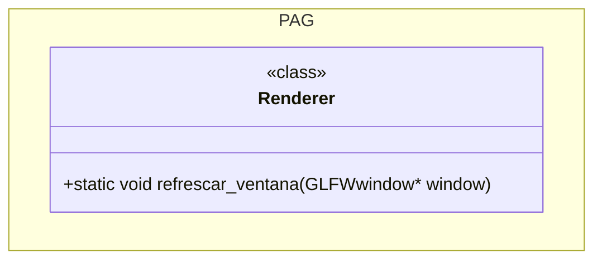
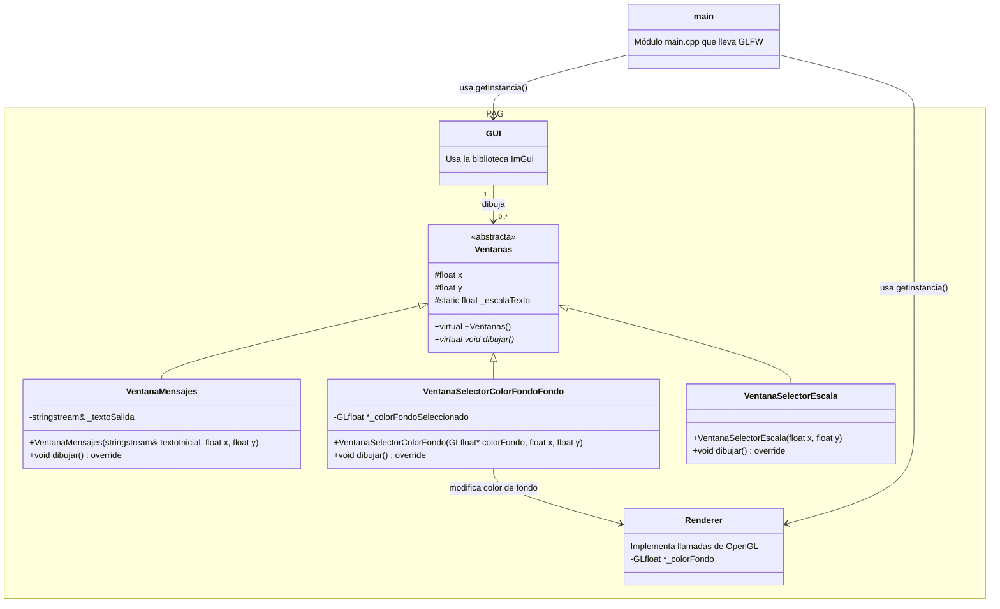
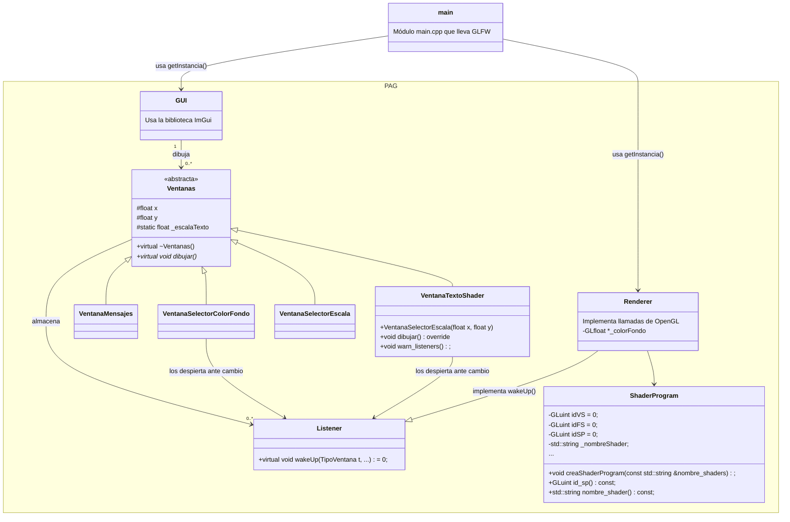
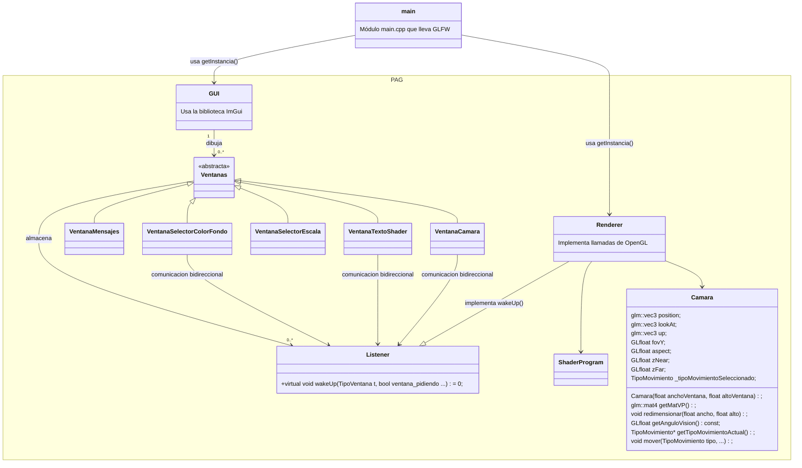

# PAG 26-27 Raúl Fernández Rivilla

## Índice

- [Práctica 1: Introducción. Inclusión de un callback para la rueda del ratón y ejercicio de reflexión.](#práctica-1)

- [Práctica 2: Refactorización y desacoplamiento de código. Incorporación de ImGui y patrones **_Singletone_ y Observador**.](#práctica-2)

- [Práctica 3: Implementación de Program Shader y modelo de un triángulo](#práctica)

## Práctica 1

### Callback de cambio de color mediante "scroll" del ratón

Para la implementación de este callback, se ha optado por hacer que la ventana varíe en su tonalidad de gris conforme
se desplaza la rueda del ratón. Para esta finalidad es importante obtener el color actual de la ventana sobre el que hacer una variación. 
Esto se consigue mediante la constante `GL_COLOR_CLEAR_VALUE`.

Después, es importante que el valor de los colores no exceda de sus rangos. En OpenGL es [0, 1]. Por tanto, se ha de implementar una lógica 
para subsanar esto (ya que el scroll es infinito y nuestra paleta de colores no).

En este caso, se ha optado por hacer un bucle de colores. Por ejemplo, cuando se llega al límite superior del rojo, este vuelve a 0. Esto
ocurre igual con el límite inferior y con el resto de colores. Por tanto, esto resulta en la consecución del negro tras el blanco (subiendo el scroll)
o la consecución del blanco tras el negro (si se baja el scroll).

Cabe recalcar que si se quiere hacer una gestión básica de estos límites, se tiene la función "clamp" vista en teoría que sencillamente redondea o
"scale" que adapta el resto de valores al mayor. Como en este caso concreto `r`, `g` y `b` son iguales, 
sucederia lo mismo que con "clamp".

### Ejercicio de reflexión

#### Planteamiento

En primera instancia, consideré oportuno replicar el fallo para observar el modo en el que representa el fallo el compilador. Al crear la función en la clase `Renderer` 
dentro del espacio de nombres de `PAG` y al añadirla como callback a `glfwSetWindowRefreshCallback` el fallo que se presentaba era el siguiente:

```text
Cannot convert void(PAG::Renderer::*)(GLFWwindow *window) to parameter type GLFWwindowrefreshfun (aka void(*)(GLFWwindow *window))
```

Es decir, el fallo que nos da, es que el "tipo" de función no es correcta. La diferencia la encontramos en el primer paréntesis tras `void`. 
En uno aparece `void(PAG::Renderer::*)(GLFWwindow *window)` mientras que en el otro aparece `void(*)(GLFWwindow *window)`

`void(PAG::Renderer::*)(GLFWwindow *window)` es lo que se denomina **puntero a función miembro**. Esto quiere decir  que hasta que no se instancia un objeto de tipo Renderer, esa función no se encuentra disponible. 

Un puntero a una función miembro dista de un puntero a una función normal en el hecho de que la primera necesita saber qué instancia la está invocando para actuar sobre ella (ya que al declarar la función dentro de la clase de esta forma, se asume que se busca un cambio en el objeto).

Sin embargo, nosotros queremos una función "genérica" y desacoplada que no busca actuar sobre ninguna instancia conreta. De esta forma pude hacerlo funcionar con dos soluciones.

#### Soluciones

Una alternativa podría ser tratar a `Renderer` como un espacio de nombres anidado dentro de `PAG`. A nivel práctico se tendría lo que buscamos aunque a nivel teórico no se tendría
una clase `Renderer`.

Esta solución funciona por el hecho de que se está declarando una función genérica en un espacio de nombres que, por tanto, no está asociada a ningún objeto.

Sin embargo, haciendo esto, me acordé de la sentencia `static` que será la verdadera solución a este problema. La palabra clave **`static`** permite establecer un método dentro de una
clase que es **común a todas las instancias**. Por tanto, no está ligado a ninguna de ellas. 

Al probar esto, la compilación fue correcta y todo funcionó como debería. Además, la inicialización sucede al invocar al propio método o al generar una instancia de la clase. A partir de ahí
da igual cuántas instancias se creen que el método solo existirá una vez en memoria. Así, todos los _callbacks_ que no dependen de un objeto deben ser implementados de esta manera.


```mermaid
classDiagram
    namespace PAG {
        class Renderer {
            <<class>>
            +static void refrescar_ventana(GLFWwindow* window)
        }
    }
```


### Corrección tras la práctica 1

Al pensar que la función ``refrescar_ventana`` tenía el siguiente cuerpo:

```c++
    void Renderer::refrescar() {
        glClear(GL_COLOR_BUFFER_BIT | GL_DEPTH_BUFFER_BIT);     
        glfwSwapBuffers(window);
        std::cout << "Callback de refresco llamado" << std::endl;
    }
```

pensé que al no depender de ningún objeto podría implementarse directamente como una función estática. Sin embargo,
si se piensa en separar responsabilidades, la primera sentencia es de OpenGL (GLAD) y la segunda, de GLFW.

Por tanto, el método refrescar perteneciente a la clase ``Renderer`` ha de tener (y así es en la práctica 2) la siguiente
forma:

```c++
    void Renderer::refrescar() {
        glClear(GL_COLOR_BUFFER_BIT | GL_DEPTH_BUFFER_BIT);     
    }
```

Esto ya no puede adjuntarse al _Callback_ (ya que nos faltan sentencias en la función). Por tanto, debemos incorporar esta
responsabilidad (de OpenGL) a un _Callback_ "padre". Esto es:

```c++
    void callback_padre() {
        //Aquí iría la función de refresco OpenGL (de Renderer)    
        glfwSwapBuffers(window);
        std::cout << "Callback de refresco llamado" << std::endl;
    }
```

Así, para incluir la función de refresco de Renderer hay 2 posibilidades:
- Hacerla _static_ (en caso de que la función de refresco **no esté vinculada al estado del objeto ``Renderer``**).
- Implementar el patrón _Singletone_ que **permitiría el acceso de la función al _único objeto_ de tipo ``Renderer``**. La función sería
unívoca al existir tan solo una instancia de esta clase.

En la práctica 2 se ha optado por la segunda solución. Por tanto, entiendo que en algún punto (alguna práctica futura) 
la función de refresco será dependiente de la instancia de ``Renderer``.


## Práctica 2

Esta práctica se ha dividido en 3 etapas detalladas en las siguiente secciones.

### Desacoplamiento de OpenGL (clase Renderer)

En primera instancia se han desacoplado (como se venía anunciando en la práctica 1) las llamadas a funciones de OpenGL
en una nueva clase: ``PAG::Renderer``.

Aquí he desacoplado todo lo competente a GLAD (y por ende, a OpenGL) y he almacenado todas las variables competentes a 
la escena (en este caso, tan solo el **color de fondo**).

Lógicamente, como solo se tiene una escena (un rendering), solo se puede tener **una instancia** de la clase ``Renderer``.
Por tanto, todo este proceso se ha llevado a cabo siguiendo el patrón _Singletone_ que se detalla en el guión.

Para ello, se ha de tener un atibuto estático con la única instancia de la clase y el constructor **ha de ser privado**.

```c++
    class Renderer{
    private:
        static Renderer *instancia;
        GLfloat *_colorFondo;

        Renderer(); //Constructor privado (Singletone)
```

Para acceder a la instancia, se ha de tener el siguiente método en `Renderer.cpp`:

```c++
    PAG::Renderer *PAG::Renderer::instancia = nullptr;

    PAG::Renderer &PAG::Renderer::getInstancia() {
        if (!instancia) {
            // Lazy initialization: si aún no existe, lo crea
            instancia = new Renderer(); //<--- Aquí es donde se llama al constructor privado
        }
        return *instancia;
    }
```


De esta manera, todas las funciones que tenía en ``main.cpp`` han sido modificadas para acceder a esta única instancia y
hacer la llamada a la función OpenGL correspondiente. Un ejemplo:


```c++
  void framebuffer_size_callback(GLFWwindow *window, int width, int height) 
  {
    PAG::Renderer::getInstancia().redimensionar(width, height);
    std::cout << "Callback de redimension llamado" << std::endl;
  }
```

Y en su interior, redimensionar tiene la siguiente implementación:


```c++
    void Renderer::redimensionar(int width, int height) 
    {
        glViewport(0, 0, width, height);
    }
```

### Incorporación de ImGui

Tras instalar la biblioteca ImGui (responsable de la gestión de ventanas en esta práctica) se ha hecho una nueva clase:
`GUI`. Esta, al igual que `Renderer`, implementa el patrón _Singletone_ para operar con la biblioteca. Esta instancia tiene
3 métodos de interés:

```c++
        void inicializacionIMGUI();

        void finalizacionIMGUI();

        void dibujarVentanas(const std::vector<PAG::Ventanas*>& ventanas);
```

Las 2 primeras funciones permiten una gestión generalizada en `main.cpp` de la biblioteca ImGui. Ojo, si nos introducimos
en alguna de estas 2 primeras funciones, se observará que se tienen cuestiones **generales** de inicialización
y finalización de la biblioteca. Pondré como ejemplo la inicialización:

```c++
    void PAG::GUI::inicializacionIMGUI ()
    {
        IMGUI_CHECKVERSION();
        ImGui::CreateContext ();
        ImGuiIO& io = ImGui::GetIO();
        io.ConfigFlags |= ImGuiConfigFlags_NavEnableKeyboard;
    }
```

De esta manera, se separan responsabilidades. `GUI` no sabe si estamos con GLFW o con OpenGL. Es por ello por lo que las 
cuestiones de inicialización específicas se han delegado en `main.cpp`:


```c++
    //Inicialización de ImGui
    PAG::GUI::getInstancia().inicializacionIMGUI();

    //Para el caso de GLFW y OpenGL, hay que completar la inicialización con las siguientes llamadas:
    ImGui_ImplGlfw_InitForOpenGL ( window, true );
    ImGui_ImplOpenGL3_Init ();
```

El tercer método (para dibujar ventanas), es el más interesante de estos tres. La implementación de este método es la 
siguiente:

```c++
    void PAG::GUI::dibujarVentanas (const std::vector<PAG::Ventanas*>& ventanas)
    {
        ImGui_ImplOpenGL3_NewFrame();
        ImGui_ImplGlfw_NewFrame();
        ImGui::NewFrame();
        // Se dibujan los controles de Dear ImGui

        //Dibujado de cada ventana
        for (PAG::Ventanas* ventana : ventanas) {
            ventana->dibujar();
        }

        // Aquí va el dibujado de la escena con instrucciones OpenGL
        ImGui::Render();
        ImGui_ImplOpenGL3_RenderDrawData ( ImGui::GetDrawData() );
    }
```

Se observa que se tienen todas las cuestiones de renderizado de ImGui de ventanas en esta única función. Veamos el funcionamiento
de esto.

En primera instancia, se pasa por parámetro las ventanas. Esto lo hice para que las ventanas las crease el usuario en `main.cpp`
(permite que la implementación sea más intuitiva). Podría ponerse sin problema como atributo de la clase.

Si se observa, en la práctica 2 se pide tener al menos 2 ventanas: una que muestre los **mensajes de consola** y otra para 
**seleccionar el color de fondo**. 

Para gestionar esto, opté por establecer una jerarquía de ventanas (desde una clase abstracta `Ventanas`) para poder almacenar
las distintas ventanas en un vector y llamar a su dibujado de manera equivalente. Por tanto, el método
`dibujar()` debía ser **virtual puro** (para que fuese obligatoriamente implementado por las clases hijas). De esta manera,
la clase abstracta de ventanas tiene la siguiente forma:

```c++
    class Ventanas {
    protected:
        float x = 10;                       //Posiciones x,y de las ventanas
        float y = 10;
        static float _escalaTexto;          //Compartida por todas las ventanas (para mantener consistencia)
    public:
        virtual ~Ventanas() = default;
        virtual void dibujar() = 0;     //Indico que es un virtual puro (se ha de sobre-escribir esta función)
    };
```

Y luego cada una de las ventanas (con sus propios atributos) debían heredar de esta clase abstracta. Por ejemplo, la ventana
de mensajes de consola tiene la siguiente forma:

```c++
    class VentanaMensajes : public Ventanas{
    private:
        std::stringstream &_textoSalida;     //Importante por referencia para que se vaya actualizando
    public:
        VentanaMensajes(std::stringstream &textoInicial, float x, float y);
        void dibujar() override;
    };
```

El método `dibujar()` tiene la siguiente forma:

```c++
    void VentanaMensajes::dibujar() {

        //Posición a dibujar
        ImGui::SetNextWindowPos ( ImVec2 (x, y), ImGuiCond_Once );

        {
            if ( ImGui::Begin ( "Mensajes" ) ){ // La ventana está desplegada

                ImGui::SetWindowFontScale ( _escalaTexto ); // Escalamos el texto si fuera necesario

                //Pintamos el buffer de texto de salida
                ImGui::TextUnformatted(_textoSalida.str().c_str());
            }

            // Si la ventana no está desplegada, Begin devuelve false
            ImGui::End ();
        }
    }
```

Por tanto, en el ciclo de eventos del `main.cpp` basta con definir de forma inicial cada una de las ventanas y, en el
ciclo de eventos, mostrarlas. En esta práctica añadí también una ventana de selección de escala de texto:


```c++
    //Establecenmos una ventana de mensajes, una ventana de selección de color y una se selección de escala de fuente
    auto *ventana_mensajes = new PAG::VentanaMensajes(buffer, 10, 10);
    auto *ventana_color = new PAG::VentanaSelectorColorFondo(PAG::Renderer::getInstancia().getColorFondo(), 280,40);
    auto *ventana_escala = new PAG::VentanaSelectorEscala(100, 400);

    std::vector<PAG::Ventanas*> ventanas = {
        ventana_mensajes,
        ventana_color,
        ventana_escala
    };

    //Ciclo de eventos
    while (!glfwWindowShouldClose(window)) {
        
        PAG::Renderer::getInstancia().refrescar();

        // DIBUJADO DE VENTANAS 
        //---------------------

        PAG::GUI::getInstancia().dibujarVentanas(ventanas);
        
        //----------------------------------------------------------------------------
        
        glfwSwapBuffers(window);
        glfwPollEvents();
    }
```

De esta manera, en un diagrama UML se puede presentar todo lo mencionado de manera intuitiva:


```mermaid
classDiagram
    namespace PAG {

        class Renderer {
            Implementa llamadas de OpenGL
            -GLfloat *_colorFondo
        }

        class GUI { 
            Usa la biblioteca ImGui
        }

        class Ventanas {
            <<abstracta>>
            #float x
            #float y
            #static float _escalaTexto
            +virtual ~Ventanas()
            +virtual void dibujar()*
        }

        class VentanaMensajes {
            -stringstream& _textoSalida
            +VentanaMensajes(stringstream& textoInicial, float x, float y)
            +void dibujar() override
        }

        class VentanaSelectorColorFondoFondo {
            -GLfloat *_colorFondoSeleccionado
            +VentanaSelectorColorFondo(GLfloat* colorFondo, float x, float y)
            +void dibujar() override
        }

        class VentanaSelectorEscala {
            +VentanaSelectorEscala(float x, float y)
            +void dibujar() override
        }
    }

    Ventanas <|-- VentanaMensajes
    Ventanas <|-- VentanaSelectorColorFondoFondo
    Ventanas <|-- VentanaSelectorEscala

    GUI "1" --> "0..*" Ventanas : dibuja
    VentanaSelectorColorFondoFondo --> Renderer : modifica color de fondo

    class main {
        Módulo main.cpp que lleva GLFW
    }

    main --> Renderer : usa getInstancia()
    main --> GUI : usa getInstancia()
```
_NOTA: No he introducido todas las variables y métodos de las clases para hacer un diagrama más comprensible._


### Implementación del patrón observador

Hasta este instante, la clase **Renderer** tan solo tiene un único atributo: **_colorFondo**, que además es un puntero
(por lo que las ventanas pueden modificarlo sin problema). Entonces, tal y como está la práctica ya es completamente funcional.
Es más, el hecho de que el color sea un puntero permite que una ventana de `ImGui` pueda cambiar el color de `Renderer`y que, si `Renderer` 
cambia, cambie la ventana de `ImGui` en consecuencia. Hay comunicación bidireccional. Sin embargo, esto resulta inviable
cuando la aplicación escale con otros atributos donde se necesite esta bidireccionalidad. 
Es aquí donde entra el **Patrón observador**.

Para entender la implementación, se pondrá por caso que las ventanas son los elementos observables y `Renderer` el observador. En cuanto algo cambie en las ventanas, `Renderer`
ejecutará algo. Por ejemplo, en este caso, cada vez que cambie el color, la ventana de selección de color de fondo llamará
a `Renderer` para que ejecute la sentencia de OpenGL acorde. En un futuro, las distintas ventanas "despertarán" a `Renderer`
para que ejecuten las sentencias que se necesiten.

Para la implementación de esto, se ha optado por tener una clase abstracta `Listener` que contendrá un método `wakeUp`. 
Este, se encarga de ejecutar el código necesario según la ventana que despierte al observador.

```c++
    /**
     * Enumerado de tipo de ventanas (de Ventanas.h)
     *
     * Ellas usan este enumerado para avisar de un evento y que el Listener sepa quién lo produjo
     */
    enum TipoVentana {
        V_Mensajes,
        V_Selecc_Color_Fondo,
        V_Selecc_Escala
    };

    class Listener {
    public:
        Listener () = default;
        virtual ~Listener () = default;
        // TipoVentana es un enum para identificar el tipo de ventana
        // de la interfaz que quiere despertarme
        virtual void wakeUp ( TipoVentana t, ... ) = 0;

    };
```

Así, Renderer reimplementará el método `wakeUp`. En este caso, solo tenemos que discernir el caso en el que la ventana de selección
de color haga cambios:

```c++
    void Renderer::wakeUp(TipoVentana t, ...) {     // ... = Lista de argumentos variables según la ventana.
        switch (t) {
            case TipoVentana::V_Selecc_Color_Fondo: {     //Podría pasar un color, pero en realidad ya está cambiando _colorFondo por puntero
                    std::va_list args;
                    va_start(args, ventana_pidiendo);

                    GLfloat *colorFondoVentana = va_arg(args, GLfloat*);

                    _colorFondo[0] = colorFondoVentana[0];
                    _colorFondo[1] = colorFondoVentana[1];
                    _colorFondo[2] = colorFondoVentana[2];
                    _colorFondo[3] = colorFondoVentana[3];

                    va_end(args);

                    break;
            }
            default: ;
                // Procesar el resto de tipos de ventana
        }
        // Terminar cualquier otro procesamiento que sea necesario
    }
```

Por tanto, solo se llama cuando es necesario. Lo único que nos queda es que la ventana de color invoque a `wakeUp`. Para ello,
en la clase abstracta Ventanas se ha añadido un vector de `Listeners` que se rellenará con todas las entidades que quieran
escuchar cambios (en este caso solo Renderer):


```c++
    /**
     * Clase abstracta para establecer una jerarquía entre el tipo de ventanas
     */
    class Ventanas {
    protected:
        float x = 10;                     
        float y = 10;
        static float _escalaTexto;         
        std::vector<Listener*> _listeners;  //Observadores que se suscriben a los cambios producidos en las ventanas
    public:
        virtual ~Ventanas() = default;
        void addListener ( Listener *listener );    //Método para añadir observadores
        virtual void dibujar() = 0;   
    };
```

De esta manera, todas las ventanas tienen acceso a los `_listeners`. Ahora, quien quiera puede avisarlos cuando lo crea
conveniente. En el caso de la ventana de selección de color, se hace de la siguiente manera:

```c++
    void VentanaSelectorColorFondo::dibujar() {
        ...
                if (ImGui::ColorPicker3("##Color de paleta", (float*)_colorSeleccionado, ImGuiColorEditFlags_PickerHueWheel | ImGuiColorEditFlags_NoSidePreview | ImGuiColorEditFlags_NoInputs | ImGuiColorEditFlags_NoAlpha)) {
                    cambio_color = true;
                }

        ...
                if (cambio_color) {
                    warn_listeners();   //Avisamos a observadores si el color cambió
                }
        ...
    }

    void VentanaSelectorColorFondo::warn_listeners()
    {
        for (Listener* listener : _listeners) {
            listener->wakeUp(TipoVentana::V_Selecc_Color, _colorSeleccionado);  //<---- Anuncia el tipo de ventana y otorga la variable que necesita el observador
        }
    }
```

De esta manera, cuando `Renderer` se refresca, el valor de su propiedad de color se encontrará actualizado respecto a las
ventanas de `ImGui`. El diagrama que nos queda, es el siguiente:


```mermaid
classDiagram
    namespace PAG {

        class Renderer {
            Implementa llamadas de OpenGL
            -GLfloat *_colorFondo
        }

        class GUI { 
            Usa la biblioteca ImGui
        }

        class Ventanas {
            <<abstracta>>
            #float x
            #float y
            #static float _escalaTexto
            +virtual ~Ventanas()
            +virtual void dibujar()*
        }

        class VentanaMensajes {
            -stringstream& _textoSalida
            +VentanaMensajes(stringstream& textoInicial, float x, float y)
            +void dibujar() override
        }

        class VentanaSelectorColorFondo {
            -GLfloat *_colorFondoSeleccionado
            +VentanaSelectorColorFondo(GLfloat* colorFondo, float x, float y)
            +void warn_listeners();
            +void dibujar() override
        }

        class VentanaSelectorEscala {
            +VentanaSelectorEscala(float x, float y)
            +void dibujar() override
        }

        class Listener {
            +virtual void wakeUp ( TipoVentana t, ... ) = 0;
        }
    }

    class main {
        Módulo main.cpp que lleva GLFW
    }

    Ventanas --> "0..*" Listener : almacena

    Ventanas <|-- VentanaMensajes
    Ventanas <|-- VentanaSelectorColorFondo
    Ventanas <|-- VentanaSelectorEscala

    GUI "1" --> "0..*" Ventanas : dibuja
    
    VentanaSelectorColorFondo --> Listener : los despierta ante cambio

    main --> Renderer : usa getInstancia()
    main --> GUI : usa getInstancia()
    Renderer --|> Listener : implementa wakeUp()
```

_NOTA: En prácticas posteriores, se incorporó el cambio de color por scroll del ratón de nuevo. Esto supone un cambio que se produce en 
Renderer y que debe "observarlo" la Ventana de Color. Llegado el momento, se presentará la manera en la que se actualizó
este patrón para soportar comunicación bidireccional._

## Práctica 3

En esta práctica, se busca la incorporación del primer Shader Program para mostrar un triángulo en la escena. Veamos cada
uno de estos pasos.

### Incorporación del Shader Program

En este caso, se ha implementado un Shader Program que incorpora los shaders de vértices y de fragmentos desde ficheros aparte.
Para ello, se ha implementado un método en la clase `Renderer` que lee desde una ruta un fichero para asignarlo a un id de
shader. En caso de fallar esta apertura de fichero, se lanza una excepción indicando el tipo de shader que falló:

```c++
std::string PAG::Renderer::cargarFichero(const std::string &ruta) {
    std::ifstream archivoShader;
    archivoShader.open(ruta);
    if (!archivoShader.is_open()) {
        throw std::invalid_argument("El fichero " + ruta + " no se pudo cargar. Revisa la ruta.");
    }

    std::stringstream streamShader;
    streamShader << archivoShader.rdbuf();
    std::string codigoFuenteShader = streamShader.str();
    archivoShader.close();

    return codigoFuenteShader;
}
```

Así, el método `crearShaderProgram` se encarga de crear el Shader Program capturando todos los errores que pudieran haber
en el proceso. En este ejemplo, se han dejado unas posibles rutas de los ficheros, pero podrían tomar cualquier nombre (
se ha asumido la carpeta del proyecto como directorio de trabajo):

```c++
void PAG::Renderer::creaShaderProgram() {
    try {

        //Cargamos ficheros de shaders (vértices y fragmento)
        std::string miVertexShader = cargarFichero("pag03-vs.glsl");
        std::string miFragmentShader = cargarFichero("pag03-fs.glsl");

        //Creamos y compilamos shaders de vértice
        idVS = glCreateShader(GL_VERTEX_SHADER);
        if (idVS == 0) {throw std::invalid_argument("Falló la sentencia glCreateShader para el shader de vertices");}
        const GLchar *fuenteVS = miVertexShader.c_str();
        glShaderSource(idVS, 1, &fuenteVS, nullptr);
        glCompileShader(idVS);
        revisarFallosCompilacion(idVS, "vertices");

        //Creamos y compilamos shaders de fragmento
        idFS = glCreateShader(GL_FRAGMENT_SHADER);
        if (idFS == 0) {throw std::invalid_argument("Falló la sentencia glCreateShader para el shader de fragmentos");}
        const GLchar *fuenteFS = miFragmentShader.c_str();
        glShaderSource(idFS, 1, &fuenteFS, nullptr);
        glCompileShader(idFS);
        revisarFallosCompilacion(idFS, "fragmentos");

        idSP = glCreateProgram();
        if (idSP == 0) {throw std::invalid_argument("Falló la sentencia glCreateProgram, por lo que no se pudo crear el Shader Program");}
        glAttachShader(idSP, idVS);
        glAttachShader(idSP, idFS);
        glLinkProgram(idSP);
        revisarFallosEnlazadoPrograma(idSP);

    } catch (std::invalid_argument &e) {
        throw std::invalid_argument(
            std::string("No se pudo cargar el Shader Program\nRazon: ") + e.what());
    }
}
```

_NOTA: Esta función escala la excepción a `main.cpp`. Es por ello por lo que se hace un `throw` en el `catch`._

Se puede observar en la función anterior la presencia de funciones comprobadoras tanto de la compilación de shaders como del
enlazado del shader program. Lo único que hacen es lanzar una excepción si el código del fichero del shader es incorrecto o
si no se pudieron enlazar entre sí los shaders en el Shader Program. Sus implementaciones son las siguientes:

**Compilado de shaders**

```c++
void PAG::Renderer::revisarFallosCompilacion (GLuint id, const std::string& tipoShader) {
    //Comprobamos errores
    GLint resultadoCompilacion;
    glGetShaderiv ( id, GL_COMPILE_STATUS, &resultadoCompilacion );

    if ( resultadoCompilacion == GL_FALSE )
    {  /* Ha habido un error en la compilación.
          Para saber qué ha pasado, tenemos que recuperar el mensaje de error de
          OpenGL */
        GLint tamMsj = 0;
        std::string mensaje = "";
        glGetShaderiv ( id, GL_INFO_LOG_LENGTH, &tamMsj );

        if ( tamMsj > 0 )
        {
            GLchar* mensajeFormatoC = new GLchar[tamMsj];
            GLint datosEscritos = 0;
            glGetShaderInfoLog ( id, tamMsj, &datosEscritos, mensajeFormatoC );
            mensaje.assign ( mensajeFormatoC );
            delete[] mensajeFormatoC;
            mensajeFormatoC = nullptr;

            throw std::runtime_error("Fallo de compilación de shader de " + tipoShader + "\nMotivo: " + mensaje);
        }
        throw std::runtime_error("Fallo de compilación del shader");
    }
}
```

**Enlazado del programa**

```c++
void PAG::Renderer::revisarFallosEnlazadoPrograma (GLuint idPrograma) {
    //Comprobamos errores
    GLint resultadoEnlazado = 0;
    glGetProgramiv ( idPrograma, GL_LINK_STATUS, &resultadoEnlazado );

    if ( resultadoEnlazado == GL_FALSE )
    {  /* Ha habido un error en la compilación.
          Para saber qué ha pasado, tenemos que recuperar el mensaje de error de
          OpenGL */
        GLint tamMsj = 0;
        std::string mensaje = "";
        glGetProgramiv ( idPrograma, GL_INFO_LOG_LENGTH, &tamMsj );

        if ( tamMsj > 0 )
        {  GLchar* mensajeFormatoC = new GLchar[tamMsj];
            GLint datosEscritos = 0;
            glGetProgramInfoLog ( idPrograma, tamMsj, &datosEscritos, mensajeFormatoC );
            mensaje.assign ( mensajeFormatoC );
            delete[] mensajeFormatoC;
            mensajeFormatoC = nullptr;

            throw std::runtime_error("Fallo de enlazado del Program Shader\nMotivo: " + mensaje);
        }
        throw std::runtime_error("Fallo de enlazado del Program Shader");
    }
}
```


### Creación del modelo (triángulo)

Para este ejemplo, se ha optado por tener un triángulo en pantalla con 3 colores distintos en sus vértices. Como el 
rasterizador interpola los colores, se obtiene un triángulo con gradiente de colores. Estos colores se han implementado
con VBOs entrelazados y no entrelazados:


**VBOs no entrelazados**

```c++
void PAG::Renderer::creaModelo() {
    GLfloat vertices[] = {  //Creación del VBO de manera ENTRELAZADA (posición, color)
        -.5, -.5, 0, 
        .5, -.5, 0, 
        .0, .5, 0
    };
    GLuint indices[] = {0, 1, 2};

    //Generación y activación del VAO
    glGenVertexArrays(1, &idVAO);
    glBindVertexArray(idVAO);

    //Creación de un ÚNICO VBO de posiciones y color de los vértices
    glGenBuffers(1, &idVBO);
    glBindBuffer(GL_ARRAY_BUFFER, idVBO);
    glBufferData(GL_ARRAY_BUFFER, sizeof(vertices), vertices, GL_STATIC_DRAW);
    glVertexAttribPointer(0, 3, GL_FLOAT, GL_FALSE, 3 * sizeof(GLfloat), nullptr);
    glEnableVertexAttribArray(0); //Colocamos posición de vértices como atributo 0


    //Creación del VBO de colores de los vértices de manera NO ENTRELAZADA
    //--------------------------------------------------------------------
    GLfloat colores[] = {
        1.0, 0.4, 0.2,
        0.2, 1.0, 0.4,
        0.4, 0.2, 1.0
    };
    glGenBuffers(1, &idVBO);
    glBindBuffer(GL_ARRAY_BUFFER, idVBO);
    glBufferData(GL_ARRAY_BUFFER, sizeof(colores), colores, GL_STATIC_DRAW);
    glVertexAttribPointer(1, 3, GL_FLOAT, GL_FALSE, 3 * sizeof(GLfloat), nullptr);
    glEnableVertexAttribArray(1); //Colocamos color de vértices como atributo 1

    glGenBuffers(1, &idIBO);
    glBindBuffer(GL_ELEMENT_ARRAY_BUFFER, idIBO);
    glBufferData(GL_ELEMENT_ARRAY_BUFFER, 3 * sizeof(GLuint), indices, GL_STATIC_DRAW);
}
```

**VBO entrelazado**

```c++
void PAG::Renderer::creaModelo() {
    GLfloat vertices[] = {  //Creación del VBO de manera ENTRELAZADA (posición, color)
        -.5, -.5, 0, 1.0, 0.4, 0.2,
        .5, -.5, 0, 0.2, 1.0, 0.4,
        .0, .5, 0, 0.4, 0.2, 1.0
    };
    GLuint indices[] = {0, 1, 2};

    //Generación y activación del VAO
    glGenVertexArrays(1, &idVAO);
    glBindVertexArray(idVAO);

    //Creación de un ÚNICO VBO de posiciones y color de los vértices
    glGenBuffers(1, &idVBO);
    glBindBuffer(GL_ARRAY_BUFFER, idVBO);
    glBufferData(GL_ARRAY_BUFFER, sizeof(vertices), vertices, GL_STATIC_DRAW);

    //Datos de posiciones (location = 0)
    glVertexAttribPointer(0, 3, GL_FLOAT, GL_FALSE, 6 * sizeof(GLfloat), nullptr);
    glEnableVertexAttribArray(0); //Colocamos posición de vértices como atributo 0

    //Datos de color (location = 1)
    glVertexAttribPointer(1, 3, GL_FLOAT, GL_FALSE, 6 * sizeof(GLfloat), ((GLfloat *) NULL + (3)));
    glEnableVertexAttribArray(1); //Colocamos color de vértices como atributo 1

    glGenBuffers(1, &idIBO);
    glBindBuffer(GL_ELEMENT_ARRAY_BUFFER, idIBO);
    glBufferData(GL_ELEMENT_ARRAY_BUFFER, 3 * sizeof(GLuint), indices, GL_STATIC_DRAW);
}
```

### Alteración del triángulo ante redimensión de la ventana

Al redimensionar el viewport sucede una cosa muy curiosa: el triángulo se transforma. Se aplasta o se estira según el 
redimensionamiento que se produce.

El motivo de esto es la proyección en el viewport del volumen de visión canónico. Recordemos que el volumen de visión
canónico tiene sus coordenadas normalizadas. Concretamente (una vez se "elimina" la profundidad Z) van desde el (-1, -1) 
al (1, 1). Estas posteriormente se proyectan en el tamaño del viewport que se tenga. Sucede según las siguientes fórmulas:


$$
x_{vp} = \frac{w(x_w + 1)}{2} \qquad y_{vp} = \frac{h(y_w + 1)}{2}
$$

_En esencia, expresa las coordenadas x e y entre (0, 2) al sumarle 1. Divide entre 2 para que las coordenadas queden
expresadas en el rango (0, 1). Por último, se multiplican esas coordenadas por las dimensiones de la ventana._

Esta transformación de ventana a puerto de visión (viewport) trabaja, por tanto, con **coordenadas relativas** (x_w + 1) / 2
para conseguir **coordenadas absolutas** al multiplicar por $w$ y $h$. Se puede entender como porcentajes. 
Por ejemplo, si un punto ha de estar en el 50% de las dimensiones del viewport, siempre aparecerá en el centro (esto es 
lo que hace la conversión al rango (0, 1) de la fórmula).

Por tanto, al redimensionar el viewport, se está refrescando el `Renderer` y se están volviendo a realizar todos estos
cálculos.

_NOTA: ImGui tiene esto solventado en sus ventanas. Se puede observar que tiene el mismo efecto que el triángulo durante
el arrastre, pero luego las ventanas se adaptan para conseguir mantener sus dimensiones_

Investigando, si quisiéramos mantener las dimensiones del triángulo hay que tocar el shader de vértices. Lo más inteligente 
es expresar una de las coordenadas (pre-proyección, porque estamos antes de transformar al viewport) en función de la otra. 
Si igualamos, tenemos:

$$
\frac{w(x + 1)}{2} = \frac{h(y + 1)}{2}
$$

$$
w(x + 1) = h(y + 1)
$$

$$
w(x) = h(y)
$$

$$
y = \frac{w}{h}x
$$

Por tanto, $\frac{w}{h}$ es la **proporción de aspecto** por la que multiplicar, en este caso, la coordenada x. Por tanto,
el shader podría lucir así:

**Vertex shader**

```plain
#version 410
layout (location = 0) in vec3 posicion;
uniform float aspecto;   // ancho / alto del viewport

void main() {
    gl_Position = vec4(posicion.x / aspecto, posicion.y, posicion.z, 1.0);
}
```


## Práctica 4

En esta práctica se buscaba desacoplar la carga de un Shader Program (mediante una clase destinada a ello) e incorporar
una nueva ventana que permitiera elegir el fichero de shaders que se quiere usar.

### Creación de la clase `ShaderProgram`

Anteriormente se tenía todo lo relativo a carga de shaders y creación del Shader Program en la clase `Renderer`. Sin embargo,
se han desacoplado todos los atributos y métodos necesarios para ello en esta nueva clase. La clase `Renderer` sencillamente
tiene un atributo con una instancia de esta clase. Por tanto, la implementación de la clase `ShaderProgram`luce así:

```c++
    class ShaderProgram {
    private:
        GLuint idVS = 0; // Identificador del vertex shader
        GLuint idFS = 0; // Identificador del fragment shader
        GLuint idSP = 0; // Identificador del shader program

        std::string _nombreShader; //Nombre del shader (permitirá saber sus uniforms)

        static std::string cargarFichero(const std::string &ruta);
        static void revisarFallosCompilacion(GLuint id, const std::string& tipoShader);
        static void revisarFallosEnlazadoPrograma(GLuint idPrograma);
    public:
        ~ShaderProgram();
        void creaShaderProgram(const std::string &nombre_shaders);
        GLuint id_sp() const;
        std::string nombre_shader() const;
    };
```

De aquí, lo más importnate es el hecho de que la clase almacene el **nombre del shader** y el método `creaShaderProgram()`.
En primer lugar, el nombre del shader se decidió almacenarlo para poder cargar uniforms concretos de cada Shader (desde Renderer).

Así, `Renderer` en cada refresco revisa los _uniforms_ del shader (con el método **`controlarUniforms(idSP)`**):


```c++
    void Renderer::refrescar() {
        glClearColor(_colorFondo[0], _colorFondo[1], _colorFondo[2], _colorFondo[3]);
        glClear(GL_COLOR_BUFFER_BIT | GL_DEPTH_BUFFER_BIT); //Limpia el buffer actual

        glPolygonMode(GL_FRONT_AND_BACK, GL_FILL);

        //Si no hay shader aún cargado, no cargar ninguno
        int idSP = shader_program.id_sp();

        if (idSP != 0) {
            glUseProgram(shader_program.id_sp());
            controlarUniforms(idSP);                //<--- Método importante
            glBindVertexArray(idVAO);
            glBindBuffer(GL_ELEMENT_ARRAY_BUFFER, idIBO);
            glDrawElements(GL_TRIANGLES, 3, GL_UNSIGNED_INT, nullptr);
        }
    }
```

El método **`controlarUniforms(idSP)`** (incorporando, por ejemplo, los shaders de la cámara, que necesitan de la matriz
de visión y proyección como _uniform_) luce así:


```c++
    void Renderer::controlarUniforms(int idSP) {
        const std::string &nombre = shader_program.nombre_shader();

        if (nombre == "pag03") {
            //No tiene uniforms
        } else if (nombre == "pag05") {

            //Uniforms de cámara
            std::string nombreUniform = "matrizVP";
            GLint posicion = glGetUniformLocation(idSP, nombreUniform.c_str());

            if (posicion != -1) {
                // El uniform existe y se ha podido localizar correctamente
                glm::mat4 matrizVP_camara = _camara->getMatVP();
                glUniformMatrix4fv(posicion, 1, GL_FALSE, &matrizVP_camara[0][0]);
            }
        } else {
            //Shader desconocido: no se envían uniforms
        }
    }
```

_NOTA: No se ha hecho con un switch porque este no soporta los `std::strings`._

Por otro lado, volviendo a la clase `ShaderProgram`, veamos su método clave, `creaShaderProgram()`:

```c++
    void PAG::ShaderProgram::creaShaderProgram(const std::string &nombre_shaders) {
        try {

            //Cargamos ficheros de shaders (vértices y fragmento)
            std::string carpetaProyecto = "shaders/";

            std::cout << "Cargando fichero " << nombre_shaders << "-vs.glsl" << std::endl;
            std::string miVertexShader = cargarFichero(carpetaProyecto + nombre_shaders + "-vs.glsl");
            std::cout << "Cargando fichero " << nombre_shaders << "-fs.glsl" << std::endl;
            std::string miFragmentShader = cargarFichero(carpetaProyecto + nombre_shaders + "-fs.glsl");

            //Creamos y compilamos shaders de vértice
            idVS = glCreateShader(GL_VERTEX_SHADER);
            if (idVS == 0) {throw std::invalid_argument("Falló la sentencia glCreateShader para el shader de vertices");}
            const GLchar *fuenteVS = miVertexShader.c_str();
            glShaderSource(idVS, 1, &fuenteVS, nullptr);
            glCompileShader(idVS);
            revisarFallosCompilacion(idVS, "vertices");

            //Creamos y compilamos shaders de fragmento
            idFS = glCreateShader(GL_FRAGMENT_SHADER);
            if (idFS == 0) {throw std::invalid_argument("Falló la sentencia glCreateShader para el shader de fragmentos");}
            const GLchar *fuenteFS = miFragmentShader.c_str();
            glShaderSource(idFS, 1, &fuenteFS, nullptr);
            glCompileShader(idFS);
            revisarFallosCompilacion(idFS, "fragmentos");

            idSP = glCreateProgram();
            if (idSP == 0) {throw std::invalid_argument("Falló la sentencia glCreateProgram, por lo que no se pudo crear el Shader Program");}
            glAttachShader(idSP, idVS);
            glAttachShader(idSP, idFS);
            glLinkProgram(idSP);
            revisarFallosEnlazadoPrograma(idSP);

            //En este punto, la carga del shader ha ido bien. Ponemos el nombre del shader:
            _nombreShader = nombre_shaders;

        } catch (std::invalid_argument &e) {
            throw std::invalid_argument(
                std::string("No se pudo cargar el Shader Program\nRazon: ") + e.what());
        }
    }
```

Se tiene la misma implementación que se tenía en la clase `Renderer`. Por mencionar algunos detalles, se ha creado una 
carpeta `shaders/` donde almacenar los distintos shaders que se tendrán en las prácticas. Además, se considera que 
los nombres de los shaders son iguales (añadiendo el sufijo adecuado). 

Luego, se crea el shader de vértice y de fragmento (compilando cada uno de ellos) para, finalmente, crear el Shader 
Program. Este, deberá enlazarse y deberán comprobarse los fallos de enlazado que se pudieran producir. Si todo ha ido
bien, entonces nos quedamos con el nombre del shader (por el motivo previamente mencionado).

Una vez se han desacoplado los métodos relativos a la carga de shaders, ¿quién llama a estos métodos?

### Ventana de carga de shaders

Esta ventana se encargará de cargar ficheros de shaders según el nombre que se le pase en su campo de texto. La implementación
de esta nueva ventana es la siguiente:

```c++
    void VentanaTextoShader::dibujar() {
        //Posición a dibujar
        ImGui::SetNextWindowPos(ImVec2(pos_x, pos_y), ImGuiCond_Once);

        bool _buttonPressed = false;

        if (ImGui::Begin("Selector de Shader", nullptr, ImGuiWindowFlags_AlwaysAutoResize)) {
            // La ventana está desplegada

            ImVec2 posActual = ImGui::GetWindowPos();

            ImGui::SetWindowFontScale(_escalaTexto); // Escalamos el texto si fuera necesario

            ImGui::Text("Nombre de fichero:");
            ImGui::InputText("##", &_nombre, ImGuiInputTextFlags_AutoSelectAll);
            _buttonPressed = ImGui::Button("Cargar");
        }

        if (_buttonPressed) {
            std::cout << "Shader a cargar: " << _nombre << std::endl;
            warn_listeners();
        }

        // Si la ventana no está desplegada, Begin devuelve false
        ImGui::End();
    }


    void VentanaTextoShader::warn_listeners() const {
        for (Listener* listener : _listeners) {
            listener->wakeUp(TipoVentana::V_Texto_Shaders, false, _nombre.c_str());
        }
    }
```

Se puede observar que, cuando se pulsa el botón de carga de shader, se llama al patrón observador para que actúe el `Renderer`.
La sección de código que reacciona a esta llamada en la clase `Renderer` es la siguiente:

```c++
    void Renderer::wakeUp(TipoVentana t, bool ventana_pidiendo, ...) {
        
        switch (t) {
            
            ...    
            
            case TipoVentana::V_Texto_Shaders: {
                //Pasará el nombre de los shaders
                std::va_list args;
                va_start(args, ventana_pidiendo);
        
                std::string nombreShader(va_arg(args, char*));
        
                if (!nombreShader.empty()) {
                    try {
                        shader_program.creaShaderProgram(nombreShader);
                    } catch (std::exception &e) {
                        std::cout << "\n--------------------\n" << "EXCEPCIÓN: " << e.what() <<
                                "\n--------------------\n" << std::endl;
                    }
                }
        
                va_end(args);
                break;
            }
            
            ...
            
        }
    }
```

De esta manera, si actualizamos el diagrama de clases, tenemos una nueva clase (`ShaderProgram`) y tipo de ventana 
(`VentanaTextoShader`):



```mermaid
classDiagram
    namespace PAG {

        class Renderer {
            Implementa llamadas de OpenGL
            -GLfloat *_colorFondo
        }

        class GUI { 
            Usa la biblioteca ImGui
        }

        class Ventanas {
            <<abstracta>>
            #float x
            #float y
            #static float _escalaTexto
            +virtual ~Ventanas()
            +virtual void dibujar()*
        }

        class VentanaMensajes {

        }

        class VentanaSelectorColorFondo {

        }

        class VentanaSelectorEscala {

        }

        class VentanaTextoShader {
            +VentanaSelectorEscala(float x, float y)
            +void dibujar() override
            +void warn_listeners();
        }

        class Listener {
            +virtual void wakeUp ( TipoVentana t, ... ) = 0;
        }
        
        class ShaderProgram{

            -GLuint idVS = 0; 
            -GLuint idFS = 0; 
            -GLuint idSP = 0; 

            -std::string _nombreShader; 

            ...
            
            +void creaShaderProgram(const std::string &nombre_shaders);
            +GLuint id_sp() const;
            +std::string nombre_shader() const;
        }
    }

    class main {
        Módulo main.cpp que lleva GLFW
    }

    Ventanas --> "0..*" Listener : almacena

    Ventanas <|-- VentanaMensajes
    Ventanas <|-- VentanaSelectorColorFondo
    Ventanas <|-- VentanaSelectorEscala
    Ventanas <|-- VentanaTextoShader

    GUI "1" --> "0..*" Ventanas : dibuja
    
    VentanaSelectorColorFondo --> Listener : los despierta ante cambio
    VentanaTextoShader --> Listener : los despierta ante cambio

    main --> Renderer : usa getInstancia()
    main --> GUI : usa getInstancia()
    Renderer --> ShaderProgram
    Renderer --|> Listener : implementa wakeUp()
```

_NOTA: Se ha simplificado el diagrama con lo relevante para hacerlo más comprensible._


## Práctica 5

En esta práctica hay 4 elementos fundamentales con los que se ha desarrollado:

- Actualización en el patrón observador (comunicación bidireccional)
- Implementación de cámara.
- Implementación de los movimientos de cámara por ventana.
- Implementación de movimientos de cámara por ratón.

### Actualización del patrón observador (comunicación bidireccional)

En primera instancia (y para la implementación a posteriori de los movimientos de cámara) explicaré cómo se ha modificado el
patrón observador implementado hasta ahora para permitir la comunicación bidireccional entre `Renderer` y `Ventanas`.

Hasta ahora, si algo cambiaba en una ventana, se le notificaba el cambio al `Renderer` y este lanzaba su método `wakeUp()`.
Sin embargo, si hay cambios desde otra fuente al `Renderer`, la ventana se quedaría desactualizada.

Por ejemplo, supongamos el caso del color visto hasta ahora. Si re-implementamos el método de _scroll_ del ratón (que cambiaba
el fondo de `Renderer), la ventana de selección de color de fondo se queda "desactualizada", pues no recibe el cambio.

La solución por la que se ha optado (para aquellas ventanas que necesitan datos actualizados) es por establecer en el método
**`wakeUp`** de `Renderer` un _booleano_ que indique si la Ventana "envía" o "pide" información. Así, cada vez que la ventana
quiera pintarse (en cada FPS) "pedirá" información, y cada vez que se produzca un cambio "enviará" información.

```c++
    void Renderer::wakeUp(TipoVentana t, bool ventana_pidiendo, ...) {
        /**
         * ----------------------------------------------
         *          RENDERER ----> VENTANAS
         * ----------------------------------------------
         */

        if (ventana_pidiendo) {
            
            //Se otorgan datos a la ventana por referencia. Para la ventana de color sería así:
            
            switch (t) {
                case TipoVentana::V_Selecc_Color_Fondo: {
                    //Pasa el color que tendrá el fondo
                    std::va_list args;
                    va_start(args, ventana_pidiendo);

                    GLfloat *colorFondoVentana = va_arg(args, GLfloat*);

                    colorFondoVentana[0] = _colorFondo[0];
                    colorFondoVentana[1] = _colorFondo[1];
                    colorFondoVentana[2] = _colorFondo[2];
                    colorFondoVentana[3] = _colorFondo[3];

                    va_end(args);

                    break;
                }
                
                ...
            
        /**
         * ----------------------------------------------
         *          VENTANAS ----> RENDERER
         * ----------------------------------------------
         */
        } else {
            
            //Implementación actual de wakeUp. Con la ventana de color sería así:
            
            switch (t) {
                case TipoVentana::V_Selecc_Color_Fondo: {
                    //Pasa el color que tendrá el fondo
                    std::va_list args;
                    va_start(args, ventana_pidiendo);

                    GLfloat *colorFondoVentana = va_arg(args, GLfloat*);

                    _colorFondo[0] = colorFondoVentana[0];
                    _colorFondo[1] = colorFondoVentana[1];
                    _colorFondo[2] = colorFondoVentana[2];
                    _colorFondo[3] = colorFondoVentana[3];

                    va_end(args);

                    break;
                }
```

De esta manera, el método `dibujar()` de la ventanas que necesiten datos actualizados, exige realizar una llamada a este
método para pedir todos los datos que se necesiten:

```c++
    void VentanaSelectorColorFondo::dibujar() {
        ...

        if (ImGui::Begin("Selector de Color", nullptr, ImGuiWindowFlags_AlwaysAutoResize)) {
            // La ventana está desplegada

            ...

            //Se coge la variable de color del renderer
            GLfloat colorFondoSeleccionado[4] = {0,0,0,0};

            if (_renderer_listener) {
                _renderer_listener->wakeUp(TipoVentana::V_Selecc_Color_Fondo, true, colorFondoSeleccionado);
                
                //Pintado de la ventana usando colorFondoSeleccionado
                
                ...
            }
            ...
        }
    }
```

Un detalle que se puede percibir en esta implementación es la presencia de un solo _listener_ (`_renderer_listener`). 
En prácticas anteriores se tenían varios _listeners_. Sin embargo, esta bidireccionalidad exige unicidad. Si la ventana
quiere pedir datos, debe pedirlos a **una entidad**. No puede tener varias fuentes que pudieran o no existir en la lista
de _listeners_ (sería un lío).

Por eso, otro cambio es ese. Ahora las ventanas no tienen un vector de _listeners_, sino que solo se tiene uno (perteneciente
a la instancia única de `Renderer`).

De esta manera, la implementación de las ventanas relativas a la cámara será mucho más general, haciendo que la incorporación
de cambios no sea tan tediosa.


### Implementación de cámara

Para la implementación de la cámara se ha optado por una nueva clase que almacene todos los atributos necesarios para la cámara.
De esta manera, la clase `Camara` luce así:

```c++
    class Camara {
    private:
        //Inicialización de la cámara por defecto. Todos los parámetros podrán tocarse con ventanas (salvo el aspect)

        //Parámetros de la cámara (visión)
        glm::vec3 position = glm::vec3(0, 0, 2);
        glm::vec3 lookAt = glm::vec3(0, 0, 0);
        glm::vec3 up = glm::vec3(0, 1, 0);

        //Parámetros de la cámara (proyección)
        GLfloat fovY = 0.785;       //Unos 45º verticales o 72º horizontales
        GLfloat aspect;             //Se inicializa en constructor (según dimensiones de pantalla)
        GLfloat zNear = 0.0001;
        GLfloat zFar = 500;

        //Tipo de movimiento de cámara seleccionado
        TipoMovimiento _tipoMovimientoSeleccionado = Zoom;

    public:
        Camara(float anchoVentana, float altoVentana);

        glm::mat4 getMatVP ();                          //Matriz que se pasará como Uniform al shader que permite la cámara

        void redimensionar(float ancho, float alto);    //Para que la proyección sea proporcional a las dimensiones de ventana 

        GLfloat getAnguloVision() const;                //Permite modificar en tiempo real el ángulo de Zoom en la ventana correspondiente

        TipoMovimiento* getTipoMovimientoActual ();     //Para que Renderer y Ventanas sepan el tipo de movimiento en el que están

        void mover(TipoMovimiento tipo, ...);           //Método principal para mover la cámara

    private:
        //Funciones auxiliares de cálculo
        glm::vec3 obtener_vector_n();
        glm::vec3 obtener_vector_u();
        glm::vec3 obtener_vector_v();

        //Funciones de movimiento auxiliares
        void hacerZoom(GLfloat fovX);
        void hacerPan(GLfloat angulo);
        void hacerTilt(GLfloat angulo);
        void traslacionX(GLfloat variacion);
        void traslacionY(GLfloat variacion);
        void traslacionZ(GLfloat variacion);
        void hacer_orbit_longitud(GLfloat variacion);
        void hacer_orbit_latitud(GLfloat variacion);
    };
```

En esta clase, se establecen los atributos por defecto de la cámara (que podrán modificarse en su mayoría con los movimientos
de cámara). Estos definirán (con el método `getMatVP`) la matriz de visión y proyección que debe pasarse como _uniform_ al 
Shader Program correspondiente.

```c++
    glm::mat4 PAG::Camara::getMatVP () {

        glm::mat4 v, p;

        v = glm::lookAt(position, lookAt, up);
        p = glm::perspective(fovY, aspect, zNear, zFar);

        glm::mat4 devolver = p*v;
        return devolver;
    }
```

De esta manera, con el método para incorporar _uniforms_ a los shaders observado en la práctica 4, se integra esta matriz en el
shader de vértices para ser multiplicada por cada uno de los vértices (`posicion`) de los modelos:

```GLSL
#version 410

/* Entradas */
layout (location = 0) in vec3 posicion;
layout (location = 1) in vec3 color;

/* Uniforms */
/* Matriz de transformación que combina visión y proyección de cámara */
uniform mat4 matrizVP;

/* Salidas */
/* Color (RGB) de cada vértice */
out vec3 color_vertex;

void main ()
{
    color_vertex = color;
    gl_Position = matrizVP * vec4 ( posicion, 1 );
}
```

Por otro lado (antes de pasar con los diferentes movimientos), se pueden tener diferentes métodos para obtener el sistema
de coordenadas de la cámara (vectores `n`, `u` y `v`). Estos, se consiguen (como se vió en teoría) a partir de los atributos 
de la cámara (concretamente de su `posicion`, del `lookAt` y del vector vertical `up`):

```c++
    /**
     * Obtener el vector n de las coordenadas de la cámara
     */
    glm::vec3 PAG::Camara::obtener_vector_n() {
        return glm::normalize(position - lookAt);
    }

    /**
     * Obtener el vector u de las coordenadas de la cámara
     */
    glm::vec3 PAG::Camara::obtener_vector_u() {
        glm::vec3 n = obtener_vector_n();

        //Con el producto vectorial con el vector vertical (v) sale u
        return glm::normalize(glm::cross(up, n));
    }

    /**
     * Obtener el vector v de las coordenadas de la cámara
     */
    glm::vec3 PAG::Camara::obtener_vector_v() {
        glm::vec3 n = obtener_vector_n();
        glm::vec3 u = obtener_vector_u();   //Optimizable para no llamar a n 2 veces (pero mejor comprensión del proceso)

        return glm::normalize(glm::cross(n, u));
    }
```


### Implementación de movimientos de cámara por ventana

Para la implementación de los movimientos, se ha hecho un enumerado (en `Camara.h`) que permita definirlos. En concreto
serán seis:

```c++
    enum TipoMovimiento {
        Zoom,
        Pan,
        Tilt,
        Dolly,
        Crane,
        Orbit
    };
```

En base al tipo de movimiento que esté seleccionado en la cámara (que tiene un atributo para ello), el método `mover()` se
comporta de maneras diferentes. De hecho, recibe una lista de parámetros variables. Este método luce así:

```c++
    void Camara::mover(TipoMovimiento movimiento, ...) {
        switch (movimiento) {
            case (TipoMovimiento::Zoom): {
                std::va_list args;
                va_start(args, movimiento);

                GLfloat* angulo = va_arg(args, GLfloat*);
                hacerZoom(glm::radians(*angulo));

                va_end(args);
                break;
            }
            case (TipoMovimiento::Pan): {
                std::va_list args;
                va_start(args, movimiento);

                GLfloat* variacion = va_arg(args, GLfloat*);
                hacerPan(glm::radians(*variacion));

                va_end(args);
                break;
            }
            case (TipoMovimiento::Tilt): {
                std::va_list args;
                va_start(args, movimiento);

                GLfloat* variacion = va_arg(args, GLfloat*);
                hacerTilt(glm::radians(*variacion));

                va_end(args);
                break;
            }

            case (TipoMovimiento::Dolly): {
                std::va_list args;
                va_start(args, movimiento);

                GLfloat* variacion_x = va_arg(args, GLfloat*);
                GLfloat* variacion_z = va_arg(args, GLfloat*);

                //Dolly puede ser en X o en Z
                traslacionX(*variacion_x);
                traslacionZ(*variacion_z);

                va_end(args);
                break;
            }

            case (TipoMovimiento::Crane): {
                std::va_list args;
                va_start(args, movimiento);

                GLfloat* variacion_y = va_arg(args, GLfloat*);

                //Crane es en Y
                traslacionY(*variacion_y);

                va_end(args);
                break;
            }

            case (TipoMovimiento::Orbit): {
                std::va_list args;
                va_start(args, movimiento);

                GLfloat* variacion_longitud = va_arg(args, GLfloat*);
                GLfloat* variacion_latitud = va_arg(args, GLfloat*);

                //Dolly puede ser en X o en Z
                hacer_orbit_longitud(glm::radians(*variacion_longitud));
                hacer_orbit_latitud(glm::radians(*variacion_latitud));

                va_end(args);
                break;
            }
            default:;
        }
    }
```

Las implementaciones de cada uno de los movimientos se verá a lo largo de las siguientes secciones.

#### Movimiento Zoom

Se trata de un movimiento que varía el ángulo (`fovY`) de la cámara. La operación en sí no es complicada. Sin embargo, la 
convención que se suele usar para este tipo de movimiento es usar el campo de visión horizontal (`fovX`) expresado en 
grados sexagesimales. 

Es por ello, que la función `hacerZoom` (a la que se le debe pasar el ángulo en radianes), realiza esta conversión (desde 
la fórmula que se presentó en teoría):

$$
fovY = 2 \cdot \arctan(\frac{\tan(fovX/2)}{aspect})
$$

```c++
    void PAG::Camara::hacerZoom(GLfloat angulo) {
        fovY = 2.0f * atanf(tanf(angulo * 0.5f) / aspect);
    }
```

Su implementación en la ventana correspondiente para ello consta de un _Slider_ que permite seleccionar el `fovX` en grados
que se quiere (limitado por defecto entre 20 - 120º). Este _Slider_ solo se muestra si en el desplegable de la ventana
se tiene seleccionado el movimiento de Zoom. Si se tiene otro movimiento, aparecerán los controles correspondientes.

Con este caso, se verá de forma detallada cómo se produce la actualización de las variables y cómo se encuentra implementada
la nueva ventana (con la clase `VentanaCamara`), ya que el resto de movimientos funcionan igual y conviene centrarse más
en explicar el propio movimiento (ya que son algo más complejos).

En primera instancia, la clase `VentanaCamara` luce así:

```c++
    class VentanaCamara : public Ventanas{
    public:
        static const float _lim_inf_zoom;
        static const float _lim_sup_zoom;

        VentanaCamara(float x, float y);
        void dibujar() override;
        void warn_listeners(TipoMovimiento t_movimiento, GLfloat zoom) const;

    };
```

Los límites del zoom pueden observarse en el exterior de la clase porque convendrá que `Renderer` los sepa (para que, al
hacer la modificación por ratón, se respeten los límites). Será la única trasformación que tenga los límites impuestos
por la ventana, ya que la cámara como tal no tiene límite de zoom.

Lo interesante estará en el método `dibujar()`:

```c++
    void VentanaCamara::dibujar() {
        ...

        //Modificadores fijos
        const GLfloat variacion_Pan = 2.0;  //Angulo de variación
        const GLfloat variacion_Tilt = 2.0;  //Angulo de variación
        const GLfloat traslacion_X = 0.1;  //Variación de traslación (X)
        const GLfloat traslacion_Y = 0.1;  //Variación de traslación (Y)
        const GLfloat traslacion_Z = 0.1;  //Variación de traslación (Z)
        const GLfloat variacion_Orbit = 2.0; //Angulo de variacion


        if (_renderer_listener) {
            
            //Recuperamos las variables necesarias para las ventanas desde el Renderer (actualizadas)
            TipoMovimiento *tipo_movimiento_camara = nullptr;
            GLfloat angulo_Zoom = 0.0;
            _renderer_listener->wakeUp(TipoVentana::V_Manejo_Camara, true, &angulo_Zoom, &tipo_movimiento_camara);

            if (ImGui::Begin("Manejador de cámara", nullptr, ImGuiWindowFlags_AlwaysAutoResize)) {
                
                ...

                ImGui::Text("Movimiento");

                //Este vector funciona porque he puesto el mismo orden que en el enum de Camara.h
                //Es para que muestre el nombre de los enumerados
                const char* movimientos[] = { "Zoom", "Pan", "Tilt", "Dolly", "Crane", "Orbit"};

                //Sacamos el índice que ocupa el tipo de movimiento actual en el enumerado gracias a static_cast
                int movimientoActual = static_cast<int>(*tipo_movimiento_camara);

                //La ejecución entra aquí solo cuando se ha cambiado el tipo de movimiento en el desplegable
                if (ImGui::Combo("##Movimiento", &movimientoActual, movimientos, IM_ARRAYSIZE(movimientos))) {

                    //Se puede hacer la operación inversa a lo anterior (sacar un tipo de movimiento desde un índice (int))
                    *tipo_movimiento_camara = static_cast<TipoMovimiento>(movimientoActual);
                }

                switch (*tipo_movimiento_camara) {
                    case TipoMovimiento::Zoom: {
                        ImGui::Text("Ángulo");
                        bool ha_cambiado_angulo = false;
                        ha_cambiado_angulo = ImGui::SliderFloat("##SliderZoom", &angulo_Zoom, _lim_inf_zoom, _lim_sup_zoom, "%2.2fº");

                        if (ha_cambiado_angulo) {
                            _renderer_listener->wakeUp(TipoVentana::V_Manejo_Camara, false, &angulo_Zoom);
                        }
                        break;
                    }
                    
                    //Resto de movimientos ...
                }
            }
           
            ImGui::End();
        }
    }
```

Se observa como al comienzo se recuperan todas las variables de `Renderer` que esta ventana necesita tener actualizadas.
Se hace lo mismo que se presentó en la sección anterior, pasando por referencia las variables:

```c++
    void Renderer::wakeUp(TipoVentana t, bool ventana_pidiendo, ...) {
        /**
         * ----------------------------------------------
         *          RENDERER ----> VENTANAS
         * ----------------------------------------------
         */

        if (ventana_pidiendo) {

            switch (t) {
                ...
                case TipoVentana::V_Manejo_Camara: {
                    std::va_list args;
                    va_start(args, ventana_pidiendo);

                    GLfloat *angulo = va_arg(args, GLfloat*);

                    //Ventana necesita una dirección de memoria por referencia, no un valor (porque luego podrá modificar
                    //el tipo de movimiento de la cámara mediante el desplegable)
                    TipoMovimiento** t_movimiento = va_arg(args, TipoMovimiento**);

                    *angulo = _camara->getAnguloVision();
                    *t_movimiento = _camara->getTipoMovimientoActual();

                    va_end(args);
                    break;
                }
                default: ;
            }
```
_NOTA: El tipo de movimiento es un doble puntero porque interesa quedarse con la dirección de memoria del tipo de movimiento
que tiene la cámara (de cara a que la ventana pueda modificar el tipo de movimiento seleccionado desde su desplegable). Por 
tanto, se selecciona algo en el desplegable y se actualiza el tipo de movimiento de la cámara automáticamente._

De esta manera, cuando cambia el ángulo de la cámara en la ventana para hacer zoom, es el `Renderer` quien debe notificarlo
a la cámara. Esto sucede de la siguiente manera:

```c++
    void Renderer::wakeUp(TipoVentana t, bool ventana_pidiendo, ...) {
        /**
         * ----------------------------------------------
         *          RENDERER ----> VENTANAS
         * ----------------------------------------------
         */

        if (ventana_pidiendo) {
            ...

        /**
         * ----------------------------------------------
         *          VENTANAS ----> RENDERER
         * ----------------------------------------------
         */
        } else {
            switch (t) {
                ...
                case TipoVentana::V_Manejo_Camara: {
                    std::va_list args;
                    va_start(args, ventana_pidiendo);

                    //Se actualizarían los parámetros de la cámara según el tipo
                    switch (*_camara->getTipoMovimientoActual()) {
                        case(TipoMovimiento::Zoom): {
                            GLfloat *angulo = va_arg(args, GLfloat*);
                            _camara->mover(TipoMovimiento::Zoom, angulo);
                            break;
                        }
                    
                        //Otros movimientos
                    }
                }
            }
        }
```

Así, el método `mover()` de la cámara, sabiendo el tipo de movimiento que se tiene seleccionado, actúa como debería. Una vez
se ha entendido el mecanismo para que la ventana tenga actualizadas sus variables y esta sea capaz de avisar a la cámara
en último lugar, se presentarán el resto de movimientos (solo con el método `mover()`).

#### Movimiento Pan

Este movimiento consiste en la rotación de la cámara de forma horizontal. Para ello, se rota el punto _lookAt_ (desde el origen
de coordenadas de la cámara). Por tanto, debe colocarse a la cámara en el origen de coordenadas de la escena. Esta colocación
hará que se "traslade" el _lookAt_ y que, al rotar, lo haga respecto el origen de coordenadas de mundo (escena).

```c++
    void Camara::mover(TipoMovimiento movimiento, ...) {
        switch (movimiento) {
            ...
            case (TipoMovimiento::Pan): {
                std::va_list args;
                va_start(args, movimiento);

                GLfloat* variacion = va_arg(args, GLfloat*);
                hacerPan(glm::radians(*variacion));

                va_end(args);
                break;
            }
            ...
        }
    }

    void PAG::Camara::hacerPan(GLfloat angulo) {

        glm::mat4 m = glm::translate(position)
                    * glm::rotate(angulo, obtener_vector_v())
                    * glm::translate(-position);

        glm::vec4 lookAt_aux = m * glm::vec4(lookAt, 1.0f);             

        lookAt = glm::vec3(lookAt_aux);
    }
```

Lo que se está haciendo son 3 transformaciones. De atrás hacia delante, trasladamos la cámara hacia el origen de coordenadas
con _T(-position)_, luego rotamos respecto a **v** (ya que la rotación es horizontal) y luego devolvemos la cámara donde estaba.

Así, en última instancia, se aplica la transformación al punto lookAt (multiplicando por la matriz de trasformación).

#### Movimiento Tilt

Es igual que el movimiento anterior salvo por el hecho de que se hace en **vertical**. Esto causa más problemas (por vectores
colineales, en concreto `v` y `up`, que rompen la definición de parámetros de la cámara de forma brusca). Veamos la implementación.

```c++
    void Camara::mover(TipoMovimiento movimiento, ...) {
        switch (movimiento) {
            ...
            case (TipoMovimiento::Tilt): {
                std::va_list args;
                va_start(args, movimiento);

                GLfloat* variacion = va_arg(args, GLfloat*);
                hacerTilt(glm::radians(*variacion));

                va_end(args);
                break;
            }
            ...
        }
    }

    void PAG::Camara::hacerTilt(GLfloat angulo) {

        glm::vec3 v_actual = obtener_vector_v();

        glm::mat4 m = glm::translate(position)
            * glm::rotate(angulo, obtener_vector_u())
            * glm::translate(-position);

        glm::vec3 lookAt_nuevo = glm::vec3(m * glm::vec4(lookAt, 1.0f));

        //Antes de efectuar comprobamos la EXCEPCIÓN de la vertical de la cámara
        //Para ello, voy a ver si el vector v es radicalmente distinto con la trasformación que se plantea
        //(es decir, si se ha pasado al "otro lado")
        glm::vec3 nuevo_n = glm::normalize(lookAt_nuevo - position);
        glm::vec3 nueva_u = glm::normalize(glm::cross(up, nuevo_n));
        glm::vec3 nueva_v = glm::cross(nuevo_n, nueva_u);

        //Si las v son muy distintas (una mira casi al lado contrario de la anterior) el coseno es negativo
        if (glm::dot(v_actual, nueva_v) >= 0.0f) {
            lookAt = glm::vec3(lookAt_nuevo);
        }
    }
```

Para gestionar los problemas derivados de que los vectores `v` y `up` sean colineales, se optó por establecer un límite
en este movimiento (-90º a 90º). Así, lo que ocurría cuando se pasaba de este límite es que la cámara "se volteaba".

Por tanto, la comprobación que realicé fue ver si entre el sistema de coordenadas actual de la cámara y el nuevo que se
quería imponer había grandes diferencias (en concreto respecto a la orientación de `v`). Como `v` (cuando se produce el
"bug" apunta de manera contraria a la anterior `v`, es fácil ver si el coseno que forman está cerca de -1). Para hacer esto
robusto, se estableció que el coseno entre la anterior v y la nueva ha de ser positivo.


#### Movimiento Dolly y Crane

El movimiento Dolly, traslada la cámara en el eje U y N de la cámara (es decir, en el X y Z del sistema de coordenadas
local a la cámara). El movimiento Crane, traslada la cámara en el eje V (es decir, en el Y según el sistema de coordenadas
de la cámara). Por tanto, basta con sumarle a `position` y a `lookAt` una variación en los ejes `u`, `n` y `v` según
corresponda.


```c++
    void Camara::mover(TipoMovimiento movimiento, ...) {
        switch (movimiento) {
            ...
            case (TipoMovimiento::Dolly): {
                std::va_list args;
                va_start(args, movimiento);

                GLfloat* variacion_x = va_arg(args, GLfloat*);
                GLfloat* variacion_z = va_arg(args, GLfloat*);

                //Dolly puede ser en X o en Z
                traslacionX(*variacion_x);
                traslacionZ(*variacion_z);

                va_end(args);
                break;
            }

            case (TipoMovimiento::Crane): {
                std::va_list args;
                va_start(args, movimiento);

                GLfloat* variacion_y = va_arg(args, GLfloat*);

                //Crane es en Y
                traslacionY(*variacion_y);

                va_end(args);
                break;
            }
            ...
        }
    }

    void PAG::Camara::traslacionX(GLfloat variacion) {
        position = glm::vec3(position + (obtener_vector_u() * variacion));
        lookAt = glm::vec3(lookAt + (obtener_vector_u() * variacion));
    }

    void PAG::Camara::traslacionY(GLfloat variacion) {
        position = glm::vec3(position + (obtener_vector_v() * variacion));
        lookAt = glm::vec3(lookAt + (obtener_vector_v() * variacion));
    }

    void PAG::Camara::traslacionZ(GLfloat variacion) {
        position = glm::vec3(position + (obtener_vector_n() * variacion));
        lookAt = glm::vec3(lookAt + (obtener_vector_n() * variacion));
    }
```

Estos movimientos no plantean más problemas.

#### Movimiento Orbit

El movimiento Orbit hace que la cámara "orbite" de manera longitudinal o vertical (con una latitud). Se parece a los movimientos
Pan y Tilt en términos de rotación y excepciones aunque su gestión será distinta. En este caso, lo que se rota es el punto 
`position` de la cámara respecto a `lookAt`. Por tanto, esta vez se deberá centrar `lookAt` en el origen de coordenadas
de la escena y rotar `position` (respecto al eje que corresponda). Se agrupa todo en uno, quedando la siguiente implementación:


```c++
    void Camara::mover(TipoMovimiento movimiento, ...) {
        switch (movimiento) {
            ...
            case (TipoMovimiento::Orbit): {
                std::va_list args;
                va_start(args, movimiento);

                GLfloat* variacion_longitud = va_arg(args, GLfloat*);
                GLfloat* variacion_latitud = va_arg(args, GLfloat*);

                //Dolly puede ser en X o en Z
                hacer_orbit_longitud(glm::radians(*variacion_longitud));
                hacer_orbit_latitud(glm::radians(*variacion_latitud));

                va_end(args);
                break;
            }
            ...
        }
    }

    void PAG::Camara::hacer_orbit_longitud(GLfloat angulo) {
        glm::mat4 m = glm::translate(lookAt)
            * glm::rotate(angulo, obtener_vector_v())
            * glm::translate(-lookAt);

        //Aquí no hay problema con las verticales
        position = glm::vec3(m * glm::vec4(position, 1.0));

    }

    void PAG::Camara::hacer_orbit_latitud(GLfloat angulo) {

        glm::mat4 m = glm::translate(lookAt)
            * glm::rotate(angulo, obtener_vector_u())
            * glm::translate(-lookAt);

        //Aquí hay que gestionar las verticales
        glm::vec3 nueva_position = glm::vec3(m * glm::vec4(position, 1.0));

        glm::vec3 nuevo_n = glm::normalize(lookAt - nueva_position);
        glm::vec3 nueva_u = glm::normalize(glm::cross(up, nuevo_n));
        glm::vec3 nueva_v = glm::cross(nuevo_n, nueva_u);

        glm::bvec3 son_colineales = glm::epsilonEqual(nueva_v, up, glm::epsilon<float>());

        if (glm::all(son_colineales)) {
            up = glm::vec3(0,0,1);

        }else {
            up = glm::vec3(0,1,0);
        }
        position = nueva_position;
    }

```

Se observa que la implementación longitudinal es bastante similar al movimiento Pan, solo que ahora las matrices de traslación
actúan con el punto _lookAt_ y el cambio se aplica a la posición de la cámara.

Sin embargo, la implementación del Orbit en vertical gestiona los vectores colineales de otra manera. Aquí se ha optado por
hacer que cambie el vector de referencia para montar el sistema de coordenadas de cámara si se ve que se va a producir el 
conflicto entre `v` y `up` (en un rango determinado por epsilon).

De esta manera, cuando `v` y `up`son colineales, se toma al vector Z como referencia (con el que también se puede sacar `u`
en esa circunstancia). Cuando dejan de ser colineales, se deja el vector up como estaba.

### Implementación de movimientos de cámara por ratón

Para implementar estos movimientos por ratón, basta con calcular la posición relativa de este. Para que el control sea compatible
con el resto de funciones definidas hasta el momento, se ha optado por tener en cuenta el movimiento del ratón solo si
se pulsa el **click izquierdo** (botón 1).

Así, se ha optado por tener variables globales (en `main.cpp`) que estén pendientes de una pulsación de este click y de 
la posición que tiene el cursor en la ventana:

```c++

static bool CLICK_PULSADO = false;
static double POS_X_RATON_INICIO_CLICK = -1;
static double POS_Y_RATON_INICIO_CLICK = -1;

...

void mouse_button_callback(GLFWwindow *window, int button, int action, int mods) {
    if (action == GLFW_PRESS) {
        //std::cout << "Pulsado el boton: " << button << std::endl;

        if (button == 1) {
            glfwGetCursorPos(window, &POS_X_RATON_INICIO_CLICK, &POS_Y_RATON_INICIO_CLICK);
            CLICK_PULSADO = true;
        }

        //Tras procesarlo con GLFW, se pasa el callback a ImGui
        ImGuiIO& io = ImGui::GetIO ();
        io.AddMouseButtonEvent ( button, true );

    } else if (action == GLFW_RELEASE) {
        //std::cout << "Soltado el boton: " << button << std::endl;

        if (button == 1) {
            CLICK_PULSADO = false;
        }

        //Tras procesarlo con GLFW, se pasa el callback a ImGui
        ImGuiIO& io = ImGui::GetIO ();
        io.AddMouseButtonEvent ( button, false );
    }
}
```


Así, sustituyendo el callback de posición de ratón, podemos calcular el movimiento relativo del mismo de la siguiente manera:

```c++
void callback_pos_raton_camara(GLFWwindow* window, double xpos, double ypos) {

    if (CLICK_PULSADO) {
        //Si se ha hecho click, podemos calcular el movimiento relativo

        double movimiento_relativo_x = POS_X_RATON_INICIO_CLICK - xpos;
        double movimiento_relativo_y = POS_Y_RATON_INICIO_CLICK - ypos;

        PAG::Renderer::getInstancia().hacerMovimientoRaton(movimiento_relativo_x, movimiento_relativo_y);

        POS_X_RATON_INICIO_CLICK = xpos;
        POS_Y_RATON_INICIO_CLICK = ypos;
    }
}

int main() {
    
    ...
    
    glfwSetCursorPosCallback(window, callback_pos_raton_camara);    //Solo una vez antes del ciclo de ejecución
    
    ...
}
```

El método `hacerMovimientoRaton()` hace algo similar a lo que ya veíamos con `wakeUp`, actualizando la cámara según el
movimiento relativo (en x o en y) del ratón.

_Ojo, las ventanas serán conscientes de esta modificación porque cuando van a pintarse piden al `Renderer` estas variables
(como se veía anteriormente)_

De esta manera, el método encargado de hacer los movimientos de ratón es el siguiente:

```c++
    void PAG::Renderer::hacerMovimientoRaton(double movimiento_relativo_x, double movimiento_relativo_y) {
        switch (*_camara->getTipoMovimientoActual()) {

            //------------------------------
            case TipoMovimiento::Zoom: {
            //------------------------------

                //Cogemos el ángulo de visión
                GLfloat anguloVision = _camara->getAnguloVision();
                anguloVision = anguloVision + movimiento_relativo_y/2;

                //Controlo que el ángulo no se escape de los límites (sabiendo los límites que tiene la ventana que lleva esto)
                float lim_sup = VentanaCamara::_lim_sup_zoom;
                float lim_inf = VentanaCamara::_lim_inf_zoom;

                //Si excede los límites deshacemos la transformación que se quiere hacer
                anguloVision = (anguloVision < lim_inf) ? lim_inf : anguloVision;
                anguloVision = (anguloVision > lim_sup) ? lim_sup : anguloVision;

                //Actualizo la cámara
                _camara->mover(TipoMovimiento::Zoom, &anguloVision);
                break;
            }

            //------------------------------
            case TipoMovimiento::Pan: {
            //------------------------------

                //Directamente se mueve la cámara con el movimiento relativo de X
                GLfloat variacion = movimiento_relativo_x/2;
                _camara->mover(TipoMovimiento::Pan, &variacion);
                break;
            }

            //------------------------------
            case TipoMovimiento::Tilt: {
            //------------------------------

                //Directamente se mueve la cámara con el movimiento relativo de X
                GLfloat variacion = movimiento_relativo_y/2;
                _camara->mover(TipoMovimiento::Tilt, &variacion);
                break;
            }

            //------------------------------
            case TipoMovimiento::Dolly: {
            //------------------------------

                //Directamente se mueve la cámara con el movimiento relativo de X o Z
                GLfloat variacion_x = -(movimiento_relativo_x/50);
                GLfloat variacion_z = -(movimiento_relativo_y/50);
                _camara->mover(TipoMovimiento::Dolly, &variacion_x, &variacion_z);
                break;
            }

            //------------------------------
            case TipoMovimiento::Crane: {
            //------------------------------

                //Directamente se mueve la cámara con el movimiento relativo de X o Z
                GLfloat variacion_y = -(movimiento_relativo_y/50);
                _camara->mover(TipoMovimiento::Crane, &variacion_y);
                break;
            }

            //------------------------------
            case TipoMovimiento::Orbit: {
            //------------------------------

                //Directamente se mueve la cámara con el movimiento relativo de X o Z
                GLfloat variacion_y = movimiento_relativo_y/2;
                GLfloat variacion_x = movimiento_relativo_x/2;
                _camara->mover(TipoMovimiento::Orbit, &variacion_x, &variacion_y);
                break;
            }

            default: ;
        }
    }
```


#### Diagrama de clases tras implementar la cámara


```mermaid
classDiagram
    namespace PAG {

        class Renderer {
            Implementa llamadas de OpenGL
        }

        class GUI { 
            Usa la biblioteca ImGui
        }

        class Ventanas {
            <<abstracta>>
        }

        class VentanaMensajes {

        }

        class VentanaSelectorColorFondo {

        }

        class VentanaSelectorEscala {

        }

        class VentanaTextoShader {

        }

        class VentanaCamara{

        }

        class Listener {
            +virtual void wakeUp ( TipoVentana t, bool ventana_pidiendo ... ) = 0;
        }
        
        class ShaderProgram{
            
        }

        class Camara{

            glm::vec3 position;
            glm::vec3 lookAt;
            glm::vec3 up;


            GLfloat fovY;
            GLfloat aspect;
            GLfloat zNear;
            GLfloat zFar;

            TipoMovimiento _tipoMovimientoSeleccionado;

            Camara(float anchoVentana, float altoVentana);
            glm::mat4 getMatVP ();
            void redimensionar(float ancho, float alto);
            GLfloat getAnguloVision() const;
            TipoMovimiento* getTipoMovimientoActual ();
            void mover(TipoMovimiento tipo, ...);
        }
    }

    class main {
        Módulo main.cpp que lleva GLFW
    }

    Ventanas --> "0..*" Listener : almacena

    Ventanas <|-- VentanaMensajes
    Ventanas <|-- VentanaSelectorColorFondo
    Ventanas <|-- VentanaSelectorEscala
    Ventanas <|-- VentanaTextoShader
    Ventanas <|-- VentanaCamara

    GUI "1" --> "0..*" Ventanas : dibuja
    
    VentanaSelectorColorFondo --> Listener : comunicacion bidireccional
    VentanaTextoShader --> Listener : comunicacion bidireccional
    VentanaCamara --> Listener : comunicacion bidireccional

    main --> Renderer : usa getInstancia()
    main --> GUI : usa getInstancia()
    Renderer --> ShaderProgram
    Renderer --> Camara
    Renderer --|> Listener : implementa wakeUp()
```